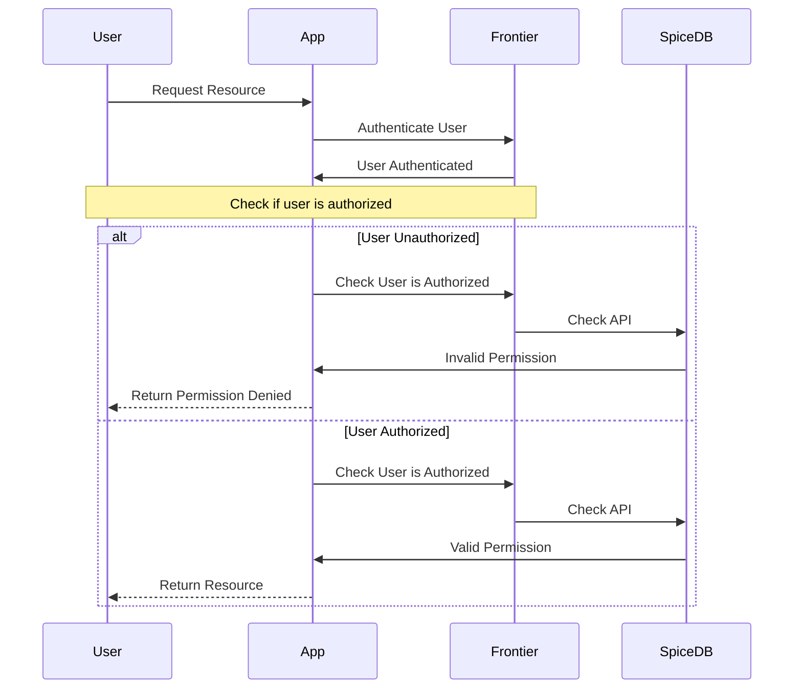

Authorization is the process of determining whether a user is allowed to perform an action on a resource. In Frontier, authorization happens after authentication (identity verification) using a powerful Role-Based Access Control (RBAC) model.

## How Authorization Works

Frontier's authorization system determines access based on roles assigned to users. When a request is made, the system checks whether the user has the necessary permissions through their assigned roles.



## RBAC Model

Frontier implements Role-Based Access Control (RBAC) with the following components:

<Steps>
  <Step title="Permissions">
    Permissions define what actions can be performed on resources. They follow the format `service.resource.verb` (e.g., `app.organization.update`).
  </Step>
  
  <Step title="Roles">
    Roles are collections of permissions that can be assigned to users. Frontier provides predefined roles like `app_organization_owner` and supports custom roles.
  </Step>
  
  <Step title="Policies">
    Policies bind roles to principals (users, groups, service accounts) on specific resources, granting the role's permissions to those principals.
  </Step>
  
  <Step title="Principals">
    Principals are entities that can be granted permissions: users, groups, or service accounts.
  </Step>
</Steps>

## SpiceDB Integration

[SpiceDB](https://authzed.com/docs) is Authzed's open-source [Google Zanzibar](https://research.google/pubs/pub48190/)-inspired permission system that powers Frontier's authorization.

SpiceDB answers the fundamental authorization question:

```
does <User> have <permission> on <resource>?
```

### How SpiceDB Works

Permissions are defined as **relationships** between users and resources. The system:

1. **Defines a schema** that specifies relationships between users and resources
2. **Stores relationships** in SpiceDB's data store
3. **Builds a permission graph** where nodes represent users/resources and edges represent permissions
4. **Traverses the graph** during permission checks to determine access

<Note>
Frontier maintains the SpiceDB schema in `base_schema.zed` and automatically syncs it with custom permissions defined at runtime.
</Note>

## Key Concepts

### Namespaces

Namespaces are logical containers that organize permissions and resources. Frontier uses:

- **Predefined namespaces**: `app/organization`, `app/project`, `app/group`, `app/user`
- **Custom namespaces**: For application-specific resources like `compute/instance` or `storage/file`

### Permission Format

Permissions are represented in multiple formats:

<CodeGroup>
```text Slug Format
app_organization_update
potato_cart_delete
```

```text Dot Notation
app.organization.update
potato.cart.delete
```

```text Namespace Format
app/organization:update
potato/cart:delete
```
</CodeGroup>

Frontier automatically converts between these formats, with the slug format (`namespace_resource_action`) used internally.

### Hierarchical Permissions

Frontier supports permission inheritance:

- **Organization-level** permissions cascade to projects, groups, and resources within that organization
- **Higher-level permissions** include lower-level capabilities (e.g., `administer` includes `update`, `get`, and `delete`)

## Authorization Flow

When a user attempts an action:

<Steps>
  <Step title="Request Initiated">
    User makes a request to access a resource or perform an action
  </Step>
  
  <Step title="Identity Retrieved">
    Frontier extracts user credentials from session, access token, or client ID/secret
  </Step>
  
  <Step title="Permission Check">
    Frontier queries SpiceDB to verify if the user has the required permission
  </Step>
  
  <Step title="Graph Traversal">
    SpiceDB traverses the permission graph, checking role bindings and relationships
  </Step>
  
  <Step title="Decision Returned">
    Access is granted if valid relationships exist, denied otherwise
  </Step>
</Steps>

## Internals: Roles and Role Bindings

Frontier models authorization using two key SpiceDB objects:

### app/role

Defines a collection of permissions. When created, Frontier establishes relations between the role and each permission:

```zed
// Example: Organization owner role with permissions
app/role:org_owner#app_organization_delete@app/user:*
app/role:org_owner#app_organization_update@app/user:*
```

### app/rolebinding

Binds a role to a principal on a resource:

```zed
// Links the user as bearer of the role
app/rolebinding:policy123#bearer@app/user:john
// Links the role to the binding
app/rolebinding:policy123#role@app/role:org_owner
// Links the binding to the resource
app/organization:acme#granted@app/rolebinding:policy123
```

<Note>
This design allows dynamic role creation/updates without schema changes, as roles are data rather than schema definitions.
</Note>

## Next Steps

<CardGroup cols={2}>
  <Card title="Permissions" icon="key" href="/authorization/permissions">
    Learn about permission management and custom permissions
  </Card>
  
  <Card title="Roles" icon="user-shield" href="/authorization/roles">
    Explore predefined and custom roles
  </Card>
  
  <Card title="Policies" icon="scroll" href="/authorization/policies">
    Understand policy management and role binding
  </Card>
  
  <Card title="Examples" icon="code" href="/authorization/examples">
    See real-world authorization patterns
  </Card>
</CardGroup>