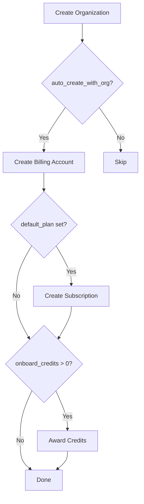

## Overview

Billing customers represent the billing relationship between an organization and Stripe. They store essential billing information including name, email, currency, address, payment methods, and tax data. Each customer has a `provider_id` that maps to the Stripe customer ID.

## Customer Structure

```json
{
  "id": "cus_123",
  "org_id": "org_123",
  "provider_id": "cus_stripe_123",
  "name": "John Doe",
  "email": "john.doe@example.com",
  "phone": "+1234567890",
  "address": {
    "line1": "123 Main St",
    "line2": "Apt 4B",
    "city": "New York",
    "state": "NY",
    "postal_code": "10001",
    "country": "USA"
  },
  "currency": "usd",
  "state": "active",
  "metadata": {},
  "created_at": "2024-03-01T00:00:00Z",
  "updated_at": "2024-03-01T00:00:00Z"
}
```

## Creating Billing Accounts

Billing accounts can be created automatically when organizations are created or manually via the API.

### Create Billing Account

<CodeGroup>
```bash cURL
curl -X POST 'https://frontier.example.com/v1beta1/organizations/{org_id}/billing' \
  -H 'Content-Type: application/json' \
  -H 'Authorization: Bearer <token>' \
  -d '{
    "name": "John Doe",
    "email": "john.doe@example.com",
    "phone": "+1234567890",
    "address": {
      "line1": "123 Main St",
      "line2": "Apt 4B",
      "city": "New York",
      "state": "NY",
      "postal_code": "10001",
      "country": "USA"
    },
    "currency": "usd"
  }'
```

```json Response
{
  "billing_account": {
    "id": "cus_123",
    "org_id": "org_123",
    "provider_id": "cus_stripe_123",
    "name": "John Doe",
    "email": "john.doe@example.com",
    "phone": "+1234567890",
    "address": {
      "line1": "123 Main St",
      "line2": "Apt 4B",
      "city": "New York",
      "state": "NY",
      "postal_code": "10001",
      "country": "USA"
    },
    "currency": "usd",
    "state": "active",
    "created_at": "2024-03-01T00:00:00Z",
    "updated_at": "2024-03-01T00:00:00Z"
  }
}
```
</CodeGroup>

### Stripe Test Clock Support

For testing purposes, you can associate a billing account with a Stripe test clock:

```bash
curl -X POST 'https://frontier.example.com/v1beta1/organizations/{org_id}/billing' \
  -H 'Content-Type: application/json' \
  -H 'X-Stripe-Test-Clock: clk_123' \
  -H 'Authorization: Bearer <token>' \
  -d '{...}'
```

<Warning>
Test clocks are for testing only. Once the clock expires, all associated resources expire. Only platform admins should use this feature.
</Warning>

## Configuration

Billing customer behavior can be customized through Frontier configuration:

### Auto-Create with Organization

Automatically create a billing account when a new organization is created:

```yaml
billing:
  customer:
    auto_create_with_org: true
```

**Default**: `true`

### Default Plan

Automatically subscribe new organizations to a default plan:

```yaml
billing:
  customer:
    default_plan: "starter_monthly"
```

When set, creating an organization automatically:
1. Creates a billing account
2. Subscribes to the specified plan
3. Applies any trial period configured in the plan

**Default**: Empty (no automatic subscription)

### Default Offline Mode

Control whether billing accounts are created in offline mode (not registered with Stripe immediately):

```yaml
billing:
  customer:
    default_offline: true
```

When `true`:
- Billing account is created in Frontier without a Stripe counterpart
- Stripe customer is created during the first checkout
- Useful for reducing Stripe resource usage for inactive customers

**Default**: `false`

### Onboard Credits

Award free credits to new organizations:

```yaml
billing:
  customer:
    onboard_credits_with_org: 100
```

Credits are automatically added to the customer's account upon creation and can be used for pay-as-you-go features.

**Default**: `0`

## Customer States

Billing customers can be in one of two states:

| State | Description |
|-------|-------------|
| **active** | Customer account is active and can make purchases |
| **disabled** | Customer account is disabled (e.g., deleted in Stripe) |

## Address and Tax Information

### Address

Customer addresses should include at minimum the postal code and country for tax calculation purposes:

```json
{
  "address": {
    "postal_code": "10001",
    "country": "USA"
  }
}
```

<Note>
While full addresses are supported, only `postal_code` and `country` are required for most billing operations.
</Note>

### Tax Data

Store tax identification numbers for customers:

```json
{
  "tax_data": [
    {
      "type": "us_ein",
      "id": "12-3456789"
    },
    {
      "type": "eu_vat",
      "id": "GB123456789"
    }
  ]
}
```

**Common Tax Types:**
- `us_ein`: US Employer Identification Number
- `eu_vat`: EU VAT number
- `gb_vat`: UK VAT number
- `in_gst`: India GST number
- `au_abn`: Australia ABN
- `ca_bn`: Canada Business Number

## Currency

Set the billing currency using three-letter ISO 4217 currency codes in lowercase:

```json
{
  "currency": "usd"  // US Dollar
}
```

**Common Currencies:**
- `usd`: US Dollar
- `eur`: Euro
- `gbp`: British Pound
- `inr`: Indian Rupee
- `cad`: Canadian Dollar
- `aud`: Australian Dollar

<Warning>
Once set, the currency cannot be changed. Plan ahead based on your primary market.
</Warning>

## Offline Customers

Offline customers exist in Frontier but not in Stripe. This is useful for:

- **Reducing Stripe costs**: Only create Stripe customers for active users
- **Testing**: Create test accounts without affecting Stripe data
- **Delayed onboarding**: Create accounts before full billing setup

Offline customers are automatically migrated to Stripe during their first checkout.

### Check if Customer is Offline

```go
if customer.IsOffline() {
  // Customer has no provider_id
  // Will be created in Stripe during checkout
}
```

## Data Synchronization

Frontier maintains a background syncer that periodically synchronizes customer data with Stripe to ensure consistency.

### Sync Process

<Steps>
  <Step title="Acquire Lock">
    Prevent race conditions by acquiring a lock before syncing.
  </Step>
  
  <Step title="Fetch from Stripe">
    Retrieve customer details from Stripe using the provider_id.
  </Step>
  
  <Step title="Check Deletion Status">
    If customer is deleted in Stripe, disable the local customer account.
  </Step>
  
  <Step title="Compare Fields">
    Compare tax data, phone, email, name, currency, and address between systems.
  </Step>
  
  <Step title="Update Database">
    Save any changes found to the Frontier database.
  </Step>
  
  <Step title="Release Lock">
    Release lock to allow next sync iteration.
  </Step>
</Steps>

### Synchronized Fields

- Tax data (type and ID)
- Phone number
- Email (if not empty in Stripe)
- Name
- Currency
- Address (city, country, line1, line2, postal_code, state)

<Note>
The sync frequency is controlled by the `refresh_interval` configuration parameter.
</Note>

## Creation Rules

Frontier enforces several rules when creating billing accounts:

1. **Single Active Account**: Only one active billing account per organization
2. **No Negative Balance**: Cannot create new accounts if existing accounts have negative credit balance
3. **Offline Mode**: If `default_offline` is true, accounts are created without Stripe registration

### Automatic Creation Flow



## Payment Methods

Customers can have multiple payment methods attached:

```json
{
  "id": "pm_123",
  "customer_id": "cus_123",
  "provider_id": "pm_stripe_123",
  "type": "card",
  "card_last4": "4242",
  "card_brand": "visa",
  "card_expiry_year": 2025,
  "card_expiry_month": 12,
  "created_at": "2024-03-01T00:00:00Z"
}
```

Payment methods are managed through Stripe Checkout or the Stripe Customer Portal.

## Updating Customers

Update customer information via the API:

```bash
curl -X PUT 'https://frontier.example.com/v1beta1/organizations/{org_id}/billing/{billing_id}' \
  -H 'Content-Type: application/json' \
  -H 'Authorization: Bearer <token>' \
  -d '{
    "email": "newemail@example.com",
    "phone": "+1987654321",
    "address": {
      "line1": "456 New St",
      "city": "San Francisco",
      "state": "CA",
      "postal_code": "94102",
      "country": "USA"
    }
  }'
```

Changes are automatically synchronized to Stripe.

## Metadata

Store custom information with customers using metadata:

```json
{
  "metadata": {
    "account_manager": "jane@example.com",
    "customer_segment": "enterprise",
    "acquisition_channel": "direct_sales"
  }
}
```

Metadata is preserved in both Frontier and Stripe.

## Best Practices

<Steps>
  <Step title="Enable Auto-Creation">
    Set `auto_create_with_org: true` to ensure every organization has billing capability.
  </Step>
  
  <Step title="Use Offline Mode Wisely">
    Enable `default_offline` if you have many organizations that may never purchase, to reduce Stripe costs.
  </Step>
  
  <Step title="Award Onboarding Credits">
    Set `onboard_credits_with_org` to give new users credits for trying pay-as-you-go features.
  </Step>
  
  <Step title="Collect Full Addresses">
    While only postal_code and country are required, full addresses help with tax compliance and fraud prevention.
  </Step>
  
  <Step title="Validate Tax IDs">
    Ensure tax identification numbers are formatted correctly for the tax type to avoid issues with tax collection.
  </Step>
</Steps>

## Troubleshooting

### Customer Not Syncing with Stripe

Check that:
1. The customer has a `provider_id` (not offline)
2. Background syncer is running (check `refresh_interval` config)
3. Stripe API credentials are correct

### Cannot Create Second Billing Account

Frontier prevents creating multiple active billing accounts per organization. If you need a new account:
1. Disable or delete the existing account
2. Ensure the existing account has no negative credit balance

### Offline Customer Not Converting to Stripe

Offline customers are only created in Stripe during checkout. Ensure:
1. Customer completes a checkout session
2. Webhook events from Stripe are being received

## Next Steps

<CardGroup cols={2}>
  <Card title="Subscriptions" icon="repeat" href="/billing/subscriptions">
    Create and manage customer subscriptions
  </Card>
  
  <Card title="Credits" icon="coins" href="/billing/credits">
    Check customer credit balance and transactions
  </Card>
  
  <Card title="Products and Plans" icon="box" href="/billing/products-and-plans">
    Define products customers can purchase
  </Card>
  
  <Card title="Entitlements" icon="shield-check" href="/billing/entitlements">
    Verify customer feature access
  </Card>
</CardGroup>