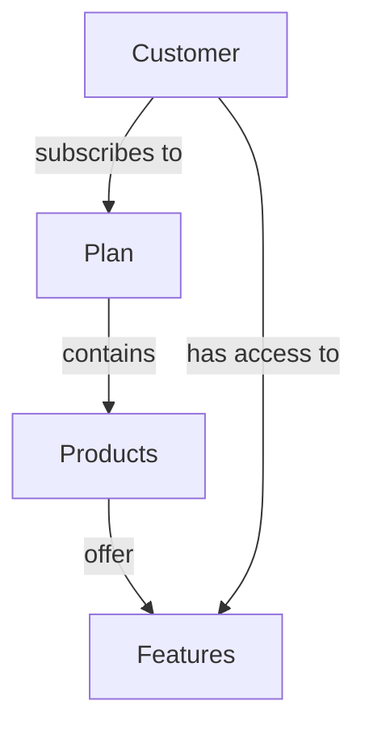

## Overview

Entitlements control which features customers can access based on their active subscriptions and purchased products. The entitlement system provides a flexible way to restrict functionality and ensure customers only access features they've paid for.

## How Entitlements Work

Frontier's entitlement system follows a simple hierarchy:

<Steps>
  <Step title="Features Belong to Products">
    Each feature is associated with one or more products. When a product is purchased, customers get access to all its features.
  </Step>
  
  <Step title="Products Belong to Plans">
    Products are bundled into plans. When a customer subscribes to a plan, they get access to all products in that plan.
  </Step>
  
  <Step title="Access is Based on Active Subscriptions">
    Only active subscriptions grant entitlements. Trialing, canceled, or expired subscriptions are considered when determining state.
  </Step>
</Steps>



## Checking Entitlements

Verify if a customer has access to a specific feature:

### Basic Entitlement Check

<CodeGroup>
```bash cURL
curl -X POST 'https://frontier.example.com/v1beta1/organizations/{org_id}/billing/{billing_id}/entitlements/{feature_id}/check' \
  -H 'Authorization: Bearer <token>'
```

```json Response (Has Access)
{
  "entitled": true
}
```

```json Response (No Access)
{
  "entitled": false
}
```
</CodeGroup>

### Entitlement Check Logic

The entitlement check performs these steps:

<Steps>
  <Step title="Get Active Subscriptions">
    Retrieve all subscriptions for the customer and filter to only active ones.
  </Step>
  
  <Step title="Get Feature Details">
    Look up the feature being checked and identify which products include it.
  </Step>
  
  <Step title="Match Products to Plans">
    Check if any of the feature's products belong to plans the customer is subscribed to.
  </Step>
  
  <Step title="Return Result">
    Return `true` if a match is found, `false` otherwise.
  </Step>
</Steps>

## Implementation Examples

### Middleware for Feature Gates

Protect API endpoints based on feature entitlements:

```javascript
// Express.js middleware example
const checkEntitlement = (featureId) => {
  return async (req, res, next) => {
    const { orgId, billingId } = req.params;
    
    try {
      const response = await fetch(
        `https://frontier.example.com/v1beta1/organizations/${orgId}/billing/${billingId}/entitlements/${featureId}/check`,
        {
          headers: {
            'Authorization': req.headers.authorization
          }
        }
      );
      
      const { entitled } = await response.json();
      
      if (!entitled) {
        return res.status(403).json({
          error: 'Feature not available in your current plan',
          upgrade_url: '/billing/plans'
        });
      }
      
      next();
    } catch (error) {
      res.status(500).json({ error: 'Failed to check entitlement' });
    }
  };
};

// Protect routes
app.post('/api/advanced-analytics', 
  checkEntitlement('advanced_analytics'),
  (req, res) => {
    // Only accessible if customer has advanced_analytics feature
    res.json({ data: runAdvancedAnalytics() });
  }
);
```

### Frontend Feature Flags

Show or hide UI elements based on entitlements:

```typescript
import { useEffect, useState } from 'react';

function useEntitlement(featureId: string) {
  const [entitled, setEntitled] = useState(false);
  const [loading, setLoading] = useState(true);
  
  useEffect(() => {
    const checkAccess = async () => {
      try {
        const response = await fetch(
          `/v1beta1/organizations/${orgId}/billing/${billingId}/entitlements/${featureId}/check`,
          {
            headers: {
              'Authorization': `Bearer ${token}`
            }
          }
        );
        
        const { entitled } = await response.json();
        setEntitled(entitled);
      } catch (error) {
        console.error('Entitlement check failed:', error);
        setEntitled(false);
      } finally {
        setLoading(false);
      }
    };
    
    checkAccess();
  }, [featureId]);
  
  return { entitled, loading };
}

// Use in component
function AdvancedFeatures() {
  const { entitled, loading } = useEntitlement('advanced_analytics');
  
  if (loading) {
    return <Spinner />;
  }
  
  if (!entitled) {
    return (
      <UpgradePrompt>
        Upgrade to Pro to access advanced analytics
      </UpgradePrompt>
    );
  }
  
  return <AdvancedAnalyticsDashboard />;
}
```

### Server-Side Feature Gates (Go)

```go
package middleware

import (
    "context"
    "net/http"
    
    "github.com/yourapp/billing"
)

func RequireFeature(featureID string, entitlementService *billing.EntitlementService) func(http.Handler) http.Handler {
    return func(next http.Handler) http.Handler {
        return http.HandlerFunc(func(w http.ResponseWriter, r *http.Request) {
            customerID := r.Context().Value("customer_id").(string)
            
            entitled, err := entitlementService.Check(r.Context(), customerID, featureID)
            if err != nil {
                http.Error(w, "Failed to check entitlement", http.StatusInternalServerError)
                return
            }
            
            if !entitled {
                http.Error(w, "Feature not available in your plan", http.StatusForbidden)
                return
            }
            
            next.ServeHTTP(w, r)
        })
    }
}

// Protect endpoints
mux.Handle("/api/advanced-analytics", 
    RequireFeature("advanced_analytics", entitlementService)(
        http.HandlerFunc(advancedAnalyticsHandler),
    ),
)
```

## Plan Eligibility

Beyond basic feature checks, Frontier provides plan eligibility verification to ensure customers meet requirements for their subscriptions.

### Check Plan Eligibility

The eligibility check verifies that:

1. **Seat limits are not exceeded**: For per-seat products
2. **Organization size is within bounds**: Based on member count
3. **All subscription constraints are met**: Custom plan requirements

```go
err := entitlementService.CheckPlanEligibility(ctx, customerID)
if err != nil {
    // Customer is not eligible for their current plan
    // This might happen if they exceed seat limits
    return errors.Wrap(err, "plan eligibility check failed")
}
```

### Seat Limit Enforcement

For products with `per_seat` behavior and configured `seat_limit`, eligibility checks prevent organizations from exceeding their user limit:

```go
// When adding a new user
func AddUserToOrganization(ctx context.Context, orgID, userID string) error {
    // First check if adding this user would breach seat limits
    err := entitlementService.CheckPlanEligibility(ctx, customerID)
    if err != nil {
        return errors.New("cannot add user: seat limit exceeded")
    }
    
    // Proceed with adding user
    return organizationService.AddMember(ctx, orgID, userID)
}
```

<Warning>
Always check plan eligibility before adding users to organizations with per-seat subscriptions. Failing to do so may result in billing inconsistencies.
</Warning>

## Active Subscription Criteria

A subscription is considered active for entitlement purposes if it meets all of these conditions:

- State is `active` or `trialing`
- Not canceled (`canceled_at` is null)
- Not ended (`ended_at` is null or in the future)
- Belongs to an active billing customer

```json
{
  "subscription": {
    "state": "active",
    "canceled_at": null,
    "ended_at": null,
    "trial_ends_at": null,
    "current_period_end_at": "2024-04-01T00:00:00Z"
  }
}
```

## Feature-Product-Plan Mapping

### Defining the Hierarchy

```yaml
features:
  - name: api_access
    title: API Access
  - name: advanced_analytics
    title: Advanced Analytics
  - name: priority_support
    title: Priority Support

products:
  - name: basic_access
    title: Basic Access
    features:
      - name: api_access
  
  - name: pro_access
    title: Pro Access
    features:
      - name: api_access
      - name: advanced_analytics
      - name: priority_support

plans:
  - name: basic_plan
    products:
      - name: basic_access
  
  - name: pro_plan
    products:
      - name: pro_access
```

### Entitlement Results

| Customer Plan | api_access | advanced_analytics | priority_support |
|---------------|------------|-------------------|------------------|
| basic_plan | ✅ Yes | ❌ No | ❌ No |
| pro_plan | ✅ Yes | ✅ Yes | ✅ Yes |
| None | ❌ No | ❌ No | ❌ No |

## Caching Entitlements

For high-traffic applications, cache entitlement checks to reduce API calls:

```javascript
const entitlementCache = new Map();
const CACHE_TTL = 5 * 60 * 1000; // 5 minutes

async function checkEntitlement(customerId, featureId) {
  const cacheKey = `${customerId}:${featureId}`;
  const cached = entitlementCache.get(cacheKey);
  
  if (cached && Date.now() - cached.timestamp < CACHE_TTL) {
    return cached.entitled;
  }
  
  const response = await fetch(
    `/v1beta1/organizations/${orgId}/billing/${billingId}/entitlements/${featureId}/check`,
    { headers: { 'Authorization': `Bearer ${token}` } }
  );
  
  const { entitled } = await response.json();
  
  entitlementCache.set(cacheKey, {
    entitled,
    timestamp: Date.now()
  });
  
  return entitled;
}
```

<Note>
Invalidate the cache when subscriptions change to ensure customers immediately get access to new features or lose access when subscriptions are canceled.
</Note>

## Graceful Degradation

Provide a good user experience when entitlements fail:

```typescript
interface FeatureGateProps {
  featureId: string;
  fallback?: React.ReactNode;
  upgradeUrl?: string;
  children: React.ReactNode;
}

function FeatureGate({ featureId, fallback, upgradeUrl, children }: FeatureGateProps) {
  const { entitled, loading } = useEntitlement(featureId);
  
  if (loading) {
    return <Skeleton />;
  }
  
  if (!entitled) {
    return fallback || (
      <div className="upgrade-prompt">
        <h3>Upgrade Required</h3>
        <p>This feature is not available in your current plan.</p>
        {upgradeUrl && (
          <a href={upgradeUrl} className="btn btn-primary">
            View Plans
          </a>
        )}
      </div>
    );
  }
  
  return <>{children}</>;
}

// Usage
<FeatureGate 
  featureId="advanced_analytics"
  upgradeUrl="/billing/plans"
>
  <AdvancedAnalyticsDashboard />
</FeatureGate>
```

## Best Practices

<Steps>
  <Step title="Check at Multiple Layers">
    Implement entitlement checks in both frontend (UI) and backend (API) for security and user experience.
  </Step>
  
  <Step title="Cache Wisely">
    Cache entitlement checks to reduce API calls, but ensure cache invalidation when subscriptions change.
  </Step>
  
  <Step title="Provide Clear Messaging">
    When access is denied, explain why and provide a path to upgrade.
  </Step>
  
  <Step title="Use Feature Flags">
    Combine entitlements with feature flags for gradual rollouts and A/B testing.
  </Step>
  
  <Step title="Monitor Denials">
    Track when users hit entitlement blocks to identify upgrade opportunities.
  </Step>
  
  <Step title="Test Edge Cases">
    Verify behavior during trial periods, at subscription renewal, and after cancellation.
  </Step>
</Steps>

## Common Patterns

### Tiered Feature Access

Offer progressive feature access across plans:

```yaml
features:
  - name: basic_api
    title: Basic API (100 req/day)
  - name: standard_api
    title: Standard API (1000 req/day)
  - name: unlimited_api
    title: Unlimited API

products:
  - name: starter
    features: [basic_api]
  - name: professional
    features: [standard_api]
  - name: enterprise
    features: [unlimited_api]
```

### Feature Bundles

Group related features into logical bundles:

```yaml
features:
  - name: collaboration_chat
  - name: collaboration_comments
  - name: collaboration_sharing

products:
  - name: collaboration_bundle
    title: Collaboration Suite
    features:
      - collaboration_chat
      - collaboration_comments
      - collaboration_sharing
```

### Add-On Features

Offer optional features across all plans:

```yaml
products:
  # Add-ons available to all plans
  - name: priority_support_addon
    title: Priority Support Add-on
    features:
      - priority_support
  
  - name: advanced_security_addon
    title: Advanced Security
    features:
      - sso
      - audit_logs
      - custom_roles
```

## Troubleshooting

### Entitlement Check Returns False Despite Active Subscription

Verify:
1. Subscription state is `active` or `trialing`
2. Feature is correctly associated with a product
3. Product is included in the plan
4. Plan ID matches the subscription's plan

### Entitlement Granted After Subscription Canceled

Check if:
- Subscription is still in current billing period
- Cache hasn't been invalidated
- Background sync hasn't updated subscription state

### Seat Limit Not Enforced

Ensure:
1. Product has `behavior: per_seat`
2. `seat_limit` is configured in product config
3. Plan eligibility check is called before adding users

## Next Steps

<CardGroup cols={2}>
  <Card title="Products and Plans" icon="box" href="/billing/products-and-plans">
    Define features and associate them with products
  </Card>
  
  <Card title="Subscriptions" icon="repeat" href="/billing/subscriptions">
    Understand how subscriptions grant entitlements
  </Card>
  
  <Card title="Credits" icon="coins" href="/billing/credits">
    Combine feature access with usage-based billing
  </Card>
  
  <Card title="Customers" icon="users" href="/billing/customers">
    Manage customer accounts and subscriptions
  </Card>
</CardGroup>