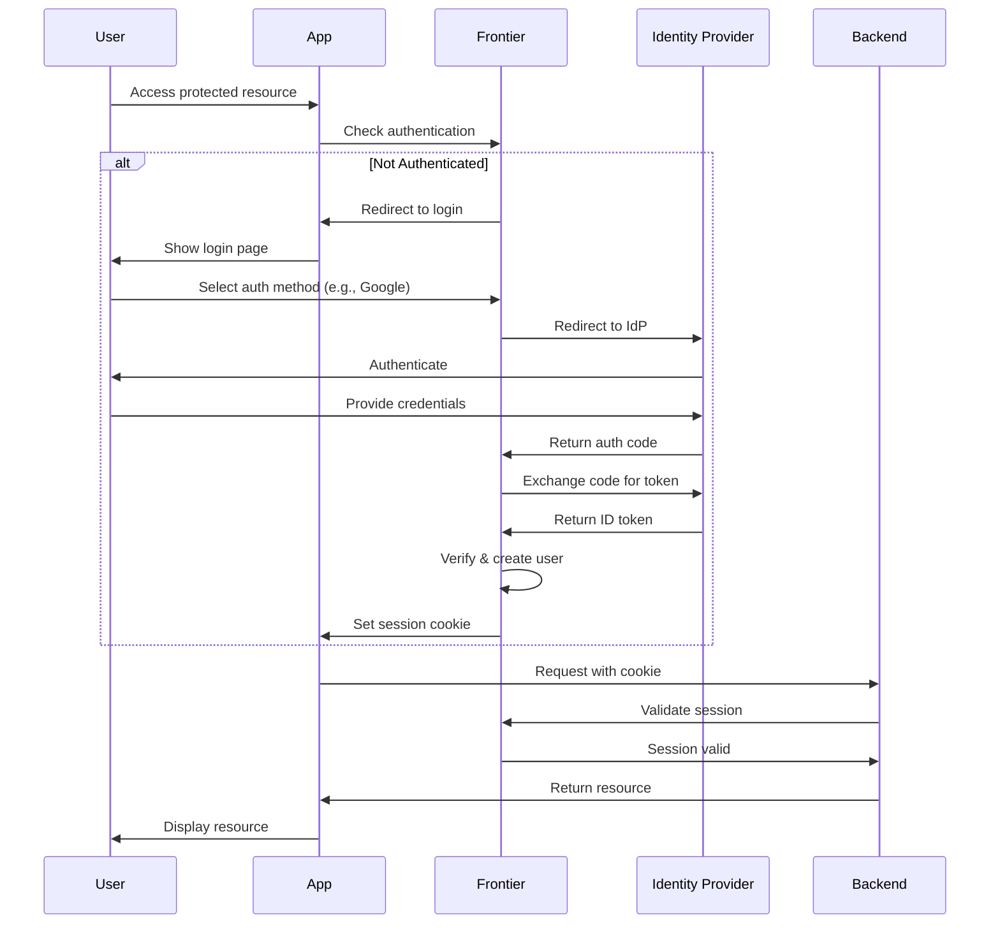
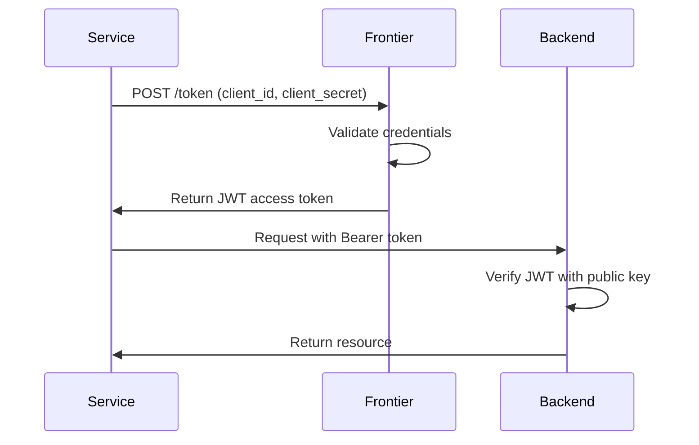
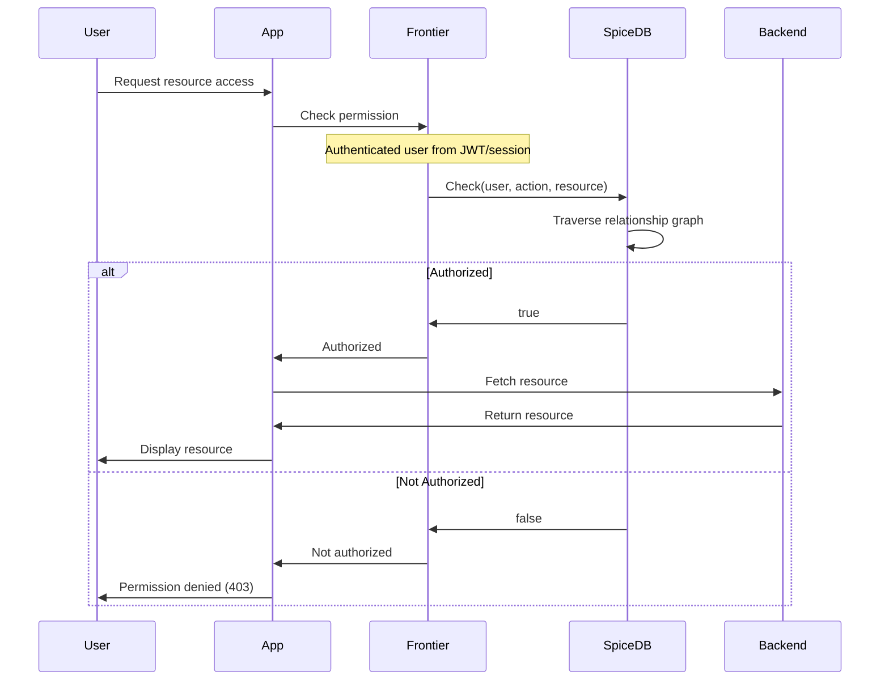

# Architecture

Frontier is a cloud-native role-based authentication and authorization server that helps you secure microservices and manage access to resources. It uses [SpiceDB](https://github.com/authzed/spicedb), an open-source fine-grained permissions database inspired by [Google Zanzibar](https://authzed.com/blog/what-is-zanzibar/).

<Note>
Frontier acts as a centralized authentication and authorization layer, allowing you to offload identity management, access control, and multi-tenancy from your application services.
</Note>

## System Overview

Frontier provides a comprehensive identity and access management solution that handles:

- **Authentication (AuthN)**: Verifying user identity through multiple strategies (social login, email OTP, API keys, JWT tokens)
- **Authorization (AuthZ)**: Role-based access control with fine-grained permissions using SpiceDB
- **Multi-tenancy**: Organization-based isolation for SaaS applications
- **API Gateway**: Proxy server for protecting backend services
- **Audit & Compliance**: Comprehensive audit logging of all access events

## Core Components

### 1. API Server

The Frontier API Server is the central component that exposes both HTTP and gRPC APIs for managing all resources.

**Key Responsibilities:**
- User, organization, project, and group management
- Authentication flow orchestration
- Policy and role management
- Session management
- Billing and subscription management
- Audit logging

**API Interfaces:**
- **HTTP REST API**: Available at the configured port (default: 7400)
- **gRPC API**: Exposed via gRPC gateway for high-performance communication
- **Proxy Server**: Runs on a separate port for request authentication and authorization

<Info>
All HTTP APIs are generated from Protocol Buffer definitions, ensuring consistency between REST and gRPC interfaces.
</Info>

### 2. PostgreSQL Database

Frontier uses **two PostgreSQL instances**:

#### Frontier Database
Stores business logic and application data:
- User profiles and credentials
- Organizations, projects, and groups
- Roles and permissions definitions
- Policies (role bindings)
- Resources and namespaces
- Audit logs
- Billing information
- Session data

#### SpiceDB Database
Stores authorization data:
- Permission relationships
- Resource hierarchies
- Access control tuples
- Authorization graph data

<Warning>
Both database instances are required for Frontier to function. The SpiceDB database is managed entirely by SpiceDB and should not be modified directly.
</Warning>

### 3. SpiceDB Authorization Engine

SpiceDB is Frontier's authorization engine, providing high-performance, Google Zanzibar-inspired permissions checking.

**Key Features:**
- **Check API**: Validates if a user can perform an action on a resource
- **Expand API**: Returns all users/groups with permissions on a resource
- **Write API**: Creates and updates permission relationships
- **Consistency**: Supports consistent reads with zookies (consistency tokens)

**How It Works:**

1. Frontier writes permission relationships to SpiceDB whenever policies are created
2. Authorization checks query SpiceDB using the Check API
3. SpiceDB traverses its relationship graph to determine access
4. Results are cached for performance

```
Check: Can user:john do action:edit on resource:doc-123?
SpiceDB → Traverse graph → Return: true/false
```

<Info>
SpiceDB uses a schema-based approach where you define object types, relations, and permissions. Frontier manages this schema automatically based on your namespace and role configurations.
</Info>

## Authentication Architecture

Frontier supports multiple authentication strategies for both human users and service accounts.

### Human User Authentication



**Authentication Strategies:**

1. **Social Login (OIDC)**: Google, GitHub, Azure AD, custom OIDC providers
2. **Email OTP**: One-time password sent to user's email
3. **Session Cookies**: Encrypted cookies for browser sessions

### Service User Authentication

For machine-to-machine communication:

1. **Client Credentials**: Client ID and Secret (API keys)
2. **JWT Bearer Tokens**: RSA-signed JWT tokens
3. **Service User Keys**: Long-lived credentials for service accounts



<Note>
JWT tokens are signed using RSA keys configured in Frontier. Backend services can verify tokens independently using the public key exposed at `/v1beta1/.well-known/jwks.json`.
</Note>

## Authorization Architecture

Frontier delegates all authorization decisions to SpiceDB using a relationship-based model.



### Authorization Components

**Permission Check Anatomy:**
```
Can <SUBJECT> perform <PERMISSION> on <OBJECT>?
```

- **Subject**: User, group, or service user (principal)
- **Permission**: Action to perform (e.g., `view`, `edit`, `delete`)
- **Object**: Resource being accessed (e.g., `project:alpha`, `document:123`)

**Example:**
```
Can user:john@example.com perform edit on project:frontend?
```

### How Policies Work

1. **Policy Creation**: Admin assigns role to user on resource
   ```json
   {
     "roleId": "app_project_owner",
     "resourceId": "project-123",
     "principalId": "user-456",
     "principalType": "user"
   }
   ```

2. **Frontier writes to SpiceDB**:
   ```
   project:project-123#owner@user:user-456
   ```

3. **Authorization check**:
   ```
   Check: user:user-456, edit, project:project-123
   SpiceDB resolves: owner role includes edit permission → true
   ```

<Info>
Frontier automatically syncs policy changes to SpiceDB. When a policy is created, updated, or deleted, the corresponding relationships in SpiceDB are updated immediately.
</Info>

## JWT Token Flow

Frontier issues JWT tokens for API authentication. These tokens are self-contained and can be verified by backend services without calling Frontier.

### Token Structure

```json
{
  "header": {
    "alg": "RS256",
    "typ": "JWT",
    "kid": "frontier-key-1"
  },
  "payload": {
    "sub": "user-id-123",
    "email": "john@example.com",
    "iss": "https://frontier.example.com",
    "aud": ["https://api.example.com"],
    "exp": 1735689600,
    "iat": 1735603200,
    "jti": "token-uuid"
  },
  "signature": "..."
}
```

### Token Issuance Flow

1. **Service User Authenticates**: Sends client credentials to Frontier
2. **Frontier Validates**: Checks credentials against database
3. **Token Generation**: Creates JWT with user claims, signs with RSA private key
4. **Token Response**: Returns access token (short-lived) and optionally refresh token
5. **Service Uses Token**: Includes token in `Authorization: Bearer <token>` header
6. **Backend Verifies**: Validates signature using Frontier's public key from JWKS endpoint

### Token Verification

Backend services verify tokens independently:

1. Fetch public keys from `https://frontier.example.com/v1beta1/.well-known/jwks.json`
2. Validate token signature using the public key matching `kid` in header
3. Verify claims: issuer, audience, expiration
4. Extract user identity from `sub` claim

<Warning>
Always verify the `iss` (issuer) and `aud` (audience) claims to prevent token misuse. Set appropriate token expiration times (typically 1 hour for access tokens).
</Warning>

## Multi-Tenancy Model

Frontier provides first-class multi-tenancy support through organizations.

```
Frontier Instance
├── Organization A (Tenant 1)
│   ├── Users
│   ├── Groups
│   ├── Projects
│   │   ├── Project Alpha
│   │   │   └── Resources
│   │   └── Project Beta
│   │       └── Resources
│   └── Policies
└── Organization B (Tenant 2)
    ├── Users
    ├── Groups
    ├── Projects
    └── Policies
```

### Key Concepts

**Organization**: Top-level tenant boundary
- Each organization is completely isolated
- Organizations have their own admins, users, and billing
- Resources belong to organizations through projects

**Project**: Logical grouping of resources within an organization
- Acts as a container for resources
- Provides a namespace for resource organization
- Enables project-level access control

**Resource**: Any entity requiring authorization
- Can be your application's resources (documents, APIs, etc.)
- Registered under a namespace (resource type)
- Attached to a project for organization

### Multi-Tenancy Benefits

1. **Data Isolation**: Each tenant's data is logically separated
2. **Customization**: Per-tenant roles, permissions, and branding
3. **Billing**: Independent billing and subscription management per organization
4. **Scalability**: Add new tenants without infrastructure changes

<Note>
Users can belong to multiple organizations. Frontier handles cross-organization access through separate policy sets for each organization.
</Note>

## Deployment Architecture

### Typical Production Setup

```
┌─────────────────────────────────────────────────┐
│                  Load Balancer                  │
└───────────────┬─────────────────────────────────┘
                │
    ┌───────────┴──────────┐
    │                      │
    ▼                      ▼
┌────────┐            ┌────────┐
│Frontier│            │Frontier│  (Multiple instances)
│Server 1│            │Server 2│
└───┬────┘            └───┬────┘
    │                     │
    └──────────┬──────────┘
               │
    ┌──────────┴──────────┐
    │                     │
    ▼                     ▼
┌──────────┐        ┌──────────┐
│PostgreSQL│        │ SpiceDB  │
│ (Frontier)│       │ Instance │
└──────────┘        └────┬─────┘
                         │
                    ┌────┴─────┐
                    │PostgreSQL│
                    │ (SpiceDB)│
                    └──────────┘
```

### High Availability Considerations

1. **Stateless Frontier Instances**: Run multiple Frontier servers behind a load balancer
2. **Database Redundancy**: Use PostgreSQL replication (primary-replica setup)
3. **SpiceDB Clustering**: Deploy SpiceDB in HA mode with multiple instances
4. **Session Storage**: Sessions stored in PostgreSQL, accessible by all Frontier instances
5. **Caching**: Consider adding Redis for caching frequently accessed permissions

<Info>
Frontier is stateless and can be horizontally scaled. All state is stored in PostgreSQL, allowing you to run as many Frontier instances as needed.
</Info>

## Proxy Architecture

Frontier includes a built-in proxy server for protecting backend services.

### How the Proxy Works

1. **Client Request**: Sent to Frontier proxy endpoint
2. **Authentication**: Proxy validates session cookie or JWT token
3. **Authorization**: Optional check against SpiceDB for resource access
4. **Header Injection**: Adds user identity headers (`X-Frontier-User-ID`, `X-Frontier-Email`)
5. **Backend Forwarding**: Proxies request to configured backend service
6. **Response**: Returns backend response to client

### Proxy Configuration

```yaml
proxy:
  port: 7401
  services:
    - name: my-api
      host: http://backend-api:8080
      prefix: /api
      authentication:
        required: true
      rules:
        - path: /api/public
          authentication:
            required: false
        - path: /api/admin
          authorization:
            permission: admin:access
            resource: app/admin
```

<Warning>
Proxy mode is useful for rapid prototyping but consider implementing authorization checks in your backend services for production deployments to reduce latency and improve reliability.
</Warning>

## Technology Stack

- **Programming Language**: Go (Golang)
- **API Framework**: gRPC with gRPC-gateway for HTTP/JSON
- **Database**: PostgreSQL 13+
- **Authorization Engine**: SpiceDB (latest stable version)
- **Session Management**: Encrypted cookies
- **Token Signing**: RSA (RS256 algorithm)
- **Containerization**: Docker

## Performance Characteristics

### Latency Targets

- **Authentication Check**: < 50ms (with session cache)
- **Authorization Check**: < 100ms (SpiceDB check + network)
- **Policy Creation**: < 200ms (database write + SpiceDB sync)
- **User Management**: < 100ms (database operations)

### Scalability

- **Concurrent Users**: 10,000+ active sessions per instance
- **Authorization Checks**: 1,000+ checks/second per SpiceDB instance
- **Horizontal Scaling**: Linear scaling by adding Frontier instances
- **Database**: PostgreSQL can handle millions of users and policies

<Note>
Performance depends on your deployment configuration, network latency, and SpiceDB tuning. Use caching strategies for frequently checked permissions to reduce load on SpiceDB.
</Note>

## Security Considerations

1. **TLS Encryption**: Always use HTTPS/TLS for Frontier API and proxy
2. **Key Rotation**: Regularly rotate RSA keys used for JWT signing
3. **Session Security**: Configure appropriate session timeouts
4. **Database Security**: Use strong passwords and network isolation for databases
5. **SpiceDB Security**: Secure gRPC connection between Frontier and SpiceDB
6. **Audit Logging**: Enable comprehensive audit logs for compliance

## Related Documentation

- [Glossary](/concepts/glossary) - Key terms and definitions
- [Authentication Guide](/docs/authn/introduction) - Detailed authentication setup
- [Authorization Guide](/docs/authz/overview) - Authorization concepts and usage
- [Configuration Reference](/docs/reference/configurations) - Complete configuration options
