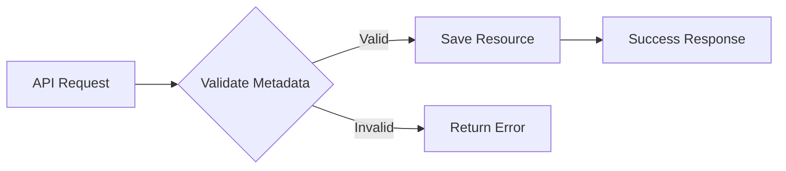

Metaschemas in Frontier are JSON Schema definitions that validate metadata attached to resources like users, organizations, groups, and projects. They ensure consistent structure and data quality across your platform.

## Overview

Metaschemas provide:
- **Structure validation** - Ensure metadata follows expected format
- **Type safety** - Validate data types (string, number, boolean, etc.)
- **Required fields** - Enforce mandatory metadata fields
- **Custom validation** - Define allowed values and patterns
- **Consistency** - Standardize metadata across resources

## How Metaschemas Work

When creating or updating a resource (user, organization, group, project), Frontier validates the `metadata` field against the corresponding metaschema. If validation fails, the request is rejected with a detailed error message.



## Default Metaschemas

Frontier includes default metaschemas for core resources, automatically created during database migration:

- **User** - `app/user` namespace
- **Organization** - `app/organization` namespace  
- **Group** - `app/group` namespace
- **Project** - `app/project` namespace
- **Role** - `app/role` namespace

## Metaschema Structure

Metaschemas follow [JSON Schema](https://json-schema.org/) specification:

```json
{
  "title": "Human-readable title",
  "description": "Schema purpose",
  "type": "object",
  "properties": {
    "field_name": {
      "type": "string",
      "title": "Field Title",
      "description": "Field description"
    }
  },
  "required": ["field_name"],
  "additionalProperties": false
}
```

### Key Properties

<ParamField path="title" type="string" required>
  Human-readable name for the schema.
</ParamField>

<ParamField path="description" type="string">
  Detailed description of the schema's purpose.
</ParamField>

<ParamField path="type" type="string" default="object">
  Root type, typically `object` for metadata structures.
</ParamField>

<ParamField path="properties" type="object">
  Defines available metadata fields and their validation rules.
</ParamField>

<ParamField path="required" type="array">
  List of required property names.
</ParamField>

<ParamField path="additionalProperties" type="boolean" default="false">
  Whether to allow properties not defined in schema.
  
  - `false` - Strict validation, only defined properties allowed
  - `true` - Allow any additional properties (disables validation)
</ParamField>

## Example Metaschemas

### User Metaschema

Validates user profile metadata:

```json User Metaschema
{
  "title": "User Metadata",
  "description": "JSON schema for validating user metadata",
  "type": "object",
  "properties": {
    "label": {
      "title": "Labels",
      "description": "Additional context about the user",
      "type": "object",
      "properties": {
        "role": {
          "type": "string",
          "title": "Role",
          "description": "User's designation in the organization"
        },
        "department": {
          "type": "string",
          "title": "Department",
          "description": "Department or team"
        }
      }
    },
    "description": {
      "title": "Description",
      "description": "Additional information about the user",
      "type": "string",
      "maxLength": 500
    },
    "avatar_color": {
      "type": "string",
      "title": "Avatar Color",
      "description": "Hex color code for avatar",
      "pattern": "^#([A-Fa-f0-9]{6}|[A-Fa-f0-9]{3})$"
    }
  },
  "additionalProperties": false
}
```

**Valid User Example:**

```json
{
  "name": "Jane Doe",
  "email": "jane@example.com",
  "metadata": {
    "label": {
      "role": "Engineering Manager",
      "department": "Platform"
    },
    "description": "Leads the platform engineering team",
    "avatar_color": "#007bff"
  }
}
```

### Organization Metaschema

Validates organization metadata:

```json Organization Metaschema
{
  "title": "Organization Metadata",
  "description": "JSON schema for validating organization metadata",
  "type": "object",
  "properties": {
    "industry": {
      "type": "string",
      "title": "Industry",
      "description": "Business industry or sector",
      "enum": [
        "technology",
        "healthcare",
        "finance",
        "education",
        "retail",
        "manufacturing",
        "other"
      ]
    },
    "company_size": {
      "type": "string",
      "title": "Company Size",
      "enum": ["1-10", "11-50", "51-200", "201-1000", "1000+"]
    },
    "website": {
      "type": "string",
      "title": "Website",
      "format": "uri",
      "pattern": "^https?://"
    },
    "address": {
      "type": "object",
      "title": "Address",
      "properties": {
        "street": {"type": "string"},
        "city": {"type": "string"},
        "state": {"type": "string"},
        "country": {"type": "string"},
        "postal_code": {"type": "string"}
      },
      "required": ["city", "country"]
    },
    "settings": {
      "type": "object",
      "title": "Settings",
      "properties": {
        "notifications_enabled": {
          "type": "boolean",
          "default": true
        },
        "data_retention_days": {
          "type": "integer",
          "minimum": 1,
          "maximum": 365,
          "default": 90
        }
      }
    }
  },
  "required": ["industry"],
  "additionalProperties": false
}
```

**Valid Organization Example:**

```json
{
  "name": "Acme Corp",
  "slug": "acme",
  "metadata": {
    "industry": "technology",
    "company_size": "51-200",
    "website": "https://acme.com",
    "address": {
      "street": "123 Main St",
      "city": "San Francisco",
      "state": "CA",
      "country": "USA",
      "postal_code": "94102"
    },
    "settings": {
      "notifications_enabled": true,
      "data_retention_days": 180
    }
  }
}
```

### Group Metaschema

Validates group metadata:

```json Group Metaschema
{
  "title": "Group Metadata",
  "description": "JSON schema for validating group metadata",
  "type": "object",
  "properties": {
    "type": {
      "type": "string",
      "title": "Group Type",
      "enum": ["team", "department", "project", "custom"]
    },
    "visibility": {
      "type": "string",
      "title": "Visibility",
      "enum": ["public", "private", "secret"],
      "default": "private"
    },
    "tags": {
      "type": "array",
      "title": "Tags",
      "items": {
        "type": "string"
      },
      "uniqueItems": true
    },
    "slack_channel": {
      "type": "string",
      "title": "Slack Channel",
      "pattern": "^#[a-z0-9-_]+$"
    }
  },
  "additionalProperties": false
}
```

### Project Metaschema

Validates project metadata:

```json Project Metaschema
{
  "title": "Project Metadata",
  "description": "JSON schema for validating project metadata",
  "type": "object",
  "properties": {
    "status": {
      "type": "string",
      "title": "Status",
      "enum": ["planning", "active", "on-hold", "completed", "archived"]
    },
    "priority": {
      "type": "string",
      "title": "Priority",
      "enum": ["low", "medium", "high", "critical"]
    },
    "start_date": {
      "type": "string",
      "title": "Start Date",
      "format": "date"
    },
    "end_date": {
      "type": "string",
      "title": "End Date",
      "format": "date"
    },
    "budget": {
      "type": "object",
      "properties": {
        "amount": {
          "type": "number",
          "minimum": 0
        },
        "currency": {
          "type": "string",
          "pattern": "^[A-Z]{3}$"
        }
      }
    },
    "external_links": {
      "type": "object",
      "properties": {
        "repository": {"type": "string", "format": "uri"},
        "documentation": {"type": "string", "format": "uri"},
        "issue_tracker": {"type": "string", "format": "uri"}
      }
    }
  },
  "additionalProperties": false
}
```

## JSON Schema Data Types

### Primitive Types

```json
{
  "properties": {
    "name": {"type": "string"},
    "age": {"type": "integer"},
    "score": {"type": "number"},
    "active": {"type": "boolean"},
    "data": {"type": "null"}
  }
}
```

### String Validation

```json
{
  "properties": {
    "email": {
      "type": "string",
      "format": "email"
    },
    "website": {
      "type": "string",
      "format": "uri"
    },
    "date": {
      "type": "string",
      "format": "date"
    },
    "code": {
      "type": "string",
      "pattern": "^[A-Z]{3}[0-9]{3}$"
    },
    "description": {
      "type": "string",
      "minLength": 10,
      "maxLength": 500
    }
  }
}
```

### Number Validation

```json
{
  "properties": {
    "quantity": {
      "type": "integer",
      "minimum": 1,
      "maximum": 100
    },
    "percentage": {
      "type": "number",
      "minimum": 0,
      "maximum": 100,
      "multipleOf": 0.01
    }
  }
}
```

### Array Validation

```json
{
  "properties": {
    "tags": {
      "type": "array",
      "items": {"type": "string"},
      "minItems": 1,
      "maxItems": 10,
      "uniqueItems": true
    },
    "coordinates": {
      "type": "array",
      "items": {"type": "number"},
      "minItems": 2,
      "maxItems": 2
    }
  }
}
```

### Object Validation

```json
{
  "properties": {
    "address": {
      "type": "object",
      "properties": {
        "street": {"type": "string"},
        "city": {"type": "string"}
      },
      "required": ["city"],
      "additionalProperties": false
    }
  }
}
```

### Enums

```json
{
  "properties": {
    "status": {
      "type": "string",
      "enum": ["active", "inactive", "suspended"]
    }
  }
}
```

## Managing Metaschemas

### Create Metaschema

Create or update a metaschema using the API:

```bash
curl -X POST http://localhost:8000/v1beta1/meta/schemas \
  -H "Content-Type: application/json" \
  -H "Authorization: Bearer $TOKEN" \
  -d '{
    "name": "app/user",
    "schema": {
      "title": "User Metadata",
      "type": "object",
      "properties": {
        "department": {
          "type": "string",
          "title": "Department"
        }
      },
      "additionalProperties": false
    }
  }'
```

### List Metaschemas

Retrieve all metaschemas:

```bash
curl -X GET http://localhost:8000/v1beta1/meta/schemas \
  -H "Authorization: Bearer $TOKEN"
```

**Response:**

```json
{
  "schemas": [
    {
      "id": "550e8400-e29b-41d4-a716-446655440000",
      "name": "app/user",
      "schema": {...},
      "created_at": "2024-01-15T10:30:00Z",
      "updated_at": "2024-01-15T10:30:00Z"
    }
  ]
}
```

### Get Specific Metaschema

```bash
curl -X GET http://localhost:8000/v1beta1/meta/schemas/{id} \
  -H "Authorization: Bearer $TOKEN"
```

### Update Metaschema

```bash
curl -X PUT http://localhost:8000/v1beta1/meta/schemas/{id} \
  -H "Content-Type: application/json" \
  -H "Authorization: Bearer $TOKEN" \
  -d '{
    "schema": {
      "title": "Updated User Metadata",
      "type": "object",
      "properties": {
        "department": {"type": "string"},
        "location": {"type": "string"}
      },
      "additionalProperties": false
    }
  }'
```

### Delete Metaschema

<Warning>
Deleting a metaschema will disable validation. Existing metadata won't be deleted but won't be validated on future updates.
</Warning>

```bash
curl -X DELETE http://localhost:8000/v1beta1/meta/schemas/{id} \
  -H "Authorization: Bearer $TOKEN"
```

## Disabling Validation

To effectively disable metaschema validation while keeping the schema:

```json
{
  "title": "Flexible User Metadata",
  "type": "object",
  "additionalProperties": true
}
```

Setting `additionalProperties: true` allows any metadata structure.

## Validation Errors

When metadata doesn't match the schema, Frontier returns detailed errors:

```json
{
  "code": "invalid_argument",
  "message": "metadata validation failed",
  "details": [
    {
      "field": "metadata.industry",
      "error": "value must be one of: technology, healthcare, finance, education, retail, manufacturing, other"
    },
    {
      "field": "metadata.website",
      "error": "value must be a valid URI starting with http:// or https://"
    }
  ]
}
```

## Best Practices

1. **Start Permissive, Then Restrict**
   ```json
   {
     "additionalProperties": true  // Initially allow flexibility
   }
   ```
   
   Once patterns emerge, tighten validation:
   ```json
   {
     "additionalProperties": false  // Enforce strict schema
   }
   ```

2. **Use Descriptive Titles and Descriptions**
   ```json
   {
     "properties": {
       "retention_days": {
         "type": "integer",
         "title": "Data Retention Period",
         "description": "Number of days to retain data before automatic deletion",
         "minimum": 1,
         "maximum": 365
       }
     }
   }
   ```

3. **Set Reasonable Defaults**
   ```json
   {
     "properties": {
       "notifications": {
         "type": "boolean",
         "default": true
       }
     }
   }
   ```

4. **Validate Formats**
   ```json
   {
     "properties": {
       "email": {"type": "string", "format": "email"},
       "url": {"type": "string", "format": "uri"},
       "date": {"type": "string", "format": "date"}
     }
   }
   ```

5. **Use Enums for Fixed Values**
   ```json
   {
     "properties": {
       "status": {
         "type": "string",
         "enum": ["draft", "published", "archived"]
       }
     }
   }
   ```

6. **Document Migration Path**
   When updating schemas, document how existing data should be migrated:
   
   ```json
   {
     "title": "User Metadata v2",
     "description": "Updated schema. Migration: rename 'role' to 'job_title'"
   }
   ```

7. **Test Schema Changes**
   Before deploying schema updates, test with existing data:
   
   ```bash
   # Export existing metadata
   curl -X GET http://localhost:8000/v1beta1/users > users.json
   
   # Validate against new schema
   # Update schema
   # Verify no validation errors
   ```

## Advanced Patterns

### Conditional Schemas

```json
{
  "properties": {
    "user_type": {
      "type": "string",
      "enum": ["individual", "enterprise"]
    }
  },
  "allOf": [
    {
      "if": {
        "properties": {"user_type": {"const": "enterprise"}}
      },
      "then": {
        "properties": {
          "company_name": {"type": "string"},
          "tax_id": {"type": "string"}
        },
        "required": ["company_name", "tax_id"]
      }
    }
  ]
}
```

### Referenced Definitions

```json
{
  "definitions": {
    "address": {
      "type": "object",
      "properties": {
        "street": {"type": "string"},
        "city": {"type": "string"}
      }
    }
  },
  "properties": {
    "billing_address": {"$ref": "#/definitions/address"},
    "shipping_address": {"$ref": "#/definitions/address"}
  }
}
```

## See Also

- [Server Configuration](/configuration/server)
- [JSON Schema Documentation](https://json-schema.org/)
- [API Reference: MetaSchemas](/api-reference/metaschemas)
- [User Management Guide](/guides/users)
- [Organization Management Guide](/guides/organizations)
