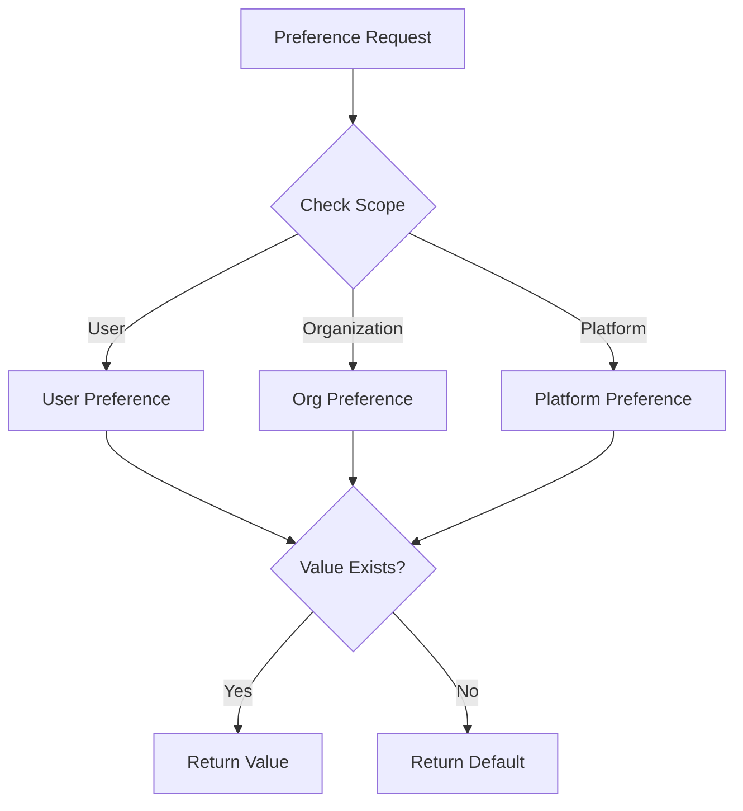

Preferences in Frontier provide a flexible system for managing platform-wide settings, organization policies, and user preferences. They enable runtime configuration without code changes.

## Overview

Frontier's preference system supports:
- **Platform settings** - Global configuration for all users
- **Organization preferences** - Organization-specific policies
- **User preferences** - Individual user settings
- **Type-safe values** - Validated inputs with defined types
- **Default values** - Fallback when preferences aren't set
- **Scoped preferences** - Different values per scope (platform, org, user)

## Preference Architecture



## Preference Traits

Preferences are defined using **traits** - templates that specify:
- Name and scope (platform/organization/user)
- Display information (title, description)
- Input type (text, checkbox, select, etc.)
- Validation rules
- Default values

Frontier includes built-in traits, and you can define custom traits.

## Built-in Platform Traits

### Platform Settings

<ParamField path="disable_orgs_on_create" type="boolean" default="false">
  Disable newly created organizations by default.
  
  **Use case:** Require admin approval before organizations become active.
  
  ```bash
  frontier preferences set -n disable_orgs_on_create -v true
  ```
</ParamField>

<ParamField path="disable_orgs_listing" type="boolean" default="false">
  Prevent non-admin APIs from listing all organizations.
  
  **Use case:** Privacy - users can only see organizations they belong to.
  
  ```bash
  frontier preferences set -n disable_orgs_listing -v true
  ```
</ParamField>

<ParamField path="disable_users_listing" type="boolean" default="false">
  Prevent non-admin APIs from listing all users.
  
  **Use case:** Privacy - users can only discover users within their organizations.
  
  ```bash
  frontier preferences set -n disable_users_listing -v true
  ```
</ParamField>

<ParamField path="invite_with_roles" type="boolean" default="false">
  Allow inviting users with specific roles.
  
  **Use case:** When enabled, invitations can include role assignments that apply when accepted.
  
  ```bash
  frontier preferences set -n invite_with_roles -v true
  ```
</ParamField>

<ParamField path="invite_mail_template_subject" type="string" default="You have been invited to join an organization">
  Subject line for invitation emails.
  
  ```bash
  frontier preferences set \
    -n invite_mail_template_subject \
    -v "Join us on Acme Platform"
  ```
</ParamField>

<ParamField path="invite_mail_template_body" type="text" default="Hi {{.UserID}}...">
  HTML body template for invitation emails.
  
  **Available variables:**
  - `{{.UserID}}` - Invited user's ID/email
  - `{{.Organization}}` - Organization name
  
  ```bash
  frontier preferences set \
    -n invite_mail_template_body \
    -v '<html><body><h1>Welcome!</h1><p>Join {{.Organization}}</p></body></html>'
  ```
</ParamField>

## Built-in Organization Traits

### Authentication Methods

<ParamField path="social_login" type="boolean" scope="organization">
  Allow login through Google, GitHub, or other OAuth providers.
  
  ```bash
  # Set for specific organization
  curl -X POST http://localhost:8000/v1beta1/preferences \
    -H "Content-Type: application/json" \
    -d '{
      "preferences": [{
        "name": "social_login",
        "value": "true",
        "scope_type": "app/organization",
        "scope_id": "org-id-here"
      }]
    }'
  ```
</ParamField>

<ParamField path="mail_otp" type="boolean" scope="organization">
  Allow passwordless login via OTP code delivered by email.
</ParamField>

<ParamField path="mail_link" type="boolean" scope="organization">
  Allow passwordless login via magic link delivered by email.
</ParamField>

## Built-in User Traits

<ParamField path="first_name" type="string" scope="user">
  User's full name for display.
</ParamField>

<ParamField path="newsletter" type="boolean" default="false" scope="user">
  Newsletter subscription preference.
</ParamField>

## Managing Preferences

### List Preferences

View all set preferences:

<CodeGroup>
```bash CLI
frontier preferences list
```

```bash API
curl -X GET http://localhost:8000/v1beta1/preferences \
  -H "Authorization: Bearer $TOKEN"
```
</CodeGroup>

**Response:**

```json
{
  "preferences": [
    {
      "id": "pref-123",
      "name": "disable_orgs_on_create",
      "value": "true",
      "resource_type": "app/platform",
      "created_at": "2024-01-15T10:30:00Z",
      "updated_at": "2024-01-15T10:30:00Z"
    }
  ]
}
```

### Get Preference Value

Retrieve a specific preference:

<CodeGroup>
```bash CLI
frontier preferences get -n disable_orgs_on_create
```

```bash API
curl -X GET "http://localhost:8000/v1beta1/preferences?name=disable_orgs_on_create" \
  -H "Authorization: Bearer $TOKEN"
```
</CodeGroup>

### Set Preference

Create or update a preference:

<CodeGroup>
```bash CLI
# Platform preference
frontier preferences set -n disable_orgs_on_create -v true

# With full flags
frontier preferences set \
  --name disable_orgs_on_create \
  --value true
```

```bash API
curl -X POST http://localhost:8000/v1beta1/preferences \
  -H "Content-Type: application/json" \
  -H "Authorization: Bearer $TOKEN" \
  -d '{
    "preferences": [
      {
        "name": "disable_orgs_on_create",
        "value": "true"
      }
    ]
  }'
```
</CodeGroup>

### Set Organization Preference

Set preference for a specific organization:

```bash
curl -X POST http://localhost:8000/v1beta1/preferences \
  -H "Content-Type: application/json" \
  -H "Authorization: Bearer $TOKEN" \
  -d '{
    "preferences": [
      {
        "name": "social_login",
        "value": "false",
        "scope_type": "app/organization",
        "scope_id": "org-123"
      }
    ]
  }'
```

### Set User Preference

```bash
curl -X POST http://localhost:8000/v1beta1/preferences \
  -H "Content-Type: application/json" \
  -H "Authorization: Bearer $TOKEN" \
  -d '{
    "preferences": [
      {
        "name": "newsletter",
        "value": "true",
        "scope_type": "app/user",
        "scope_id": "user-456"
      }
    ]
  }'
```

### Batch Update Preferences

Set multiple preferences at once:

```bash
curl -X POST http://localhost:8000/v1beta1/preferences \
  -H "Content-Type: application/json" \
  -H "Authorization: Bearer $TOKEN" \
  -d '{
    "preferences": [
      {"name": "disable_orgs_on_create", "value": "true"},
      {"name": "disable_orgs_listing", "value": "true"},
      {"name": "invite_with_roles", "value": "true"}
    ]
  }'
```

## Describing Traits

View available preference traits and their definitions:

<CodeGroup>
```bash CLI
frontier preferences get
```

```bash API
curl -X GET http://localhost:8000/v1beta1/preferences/traits \
  -H "Authorization: Bearer $TOKEN"
```
</CodeGroup>

**Response:**

```json
{
  "traits": [
    {
      "resource_type": "app/platform",
      "name": "disable_orgs_on_create",
      "title": "Disable Orgs On Create",
      "description": "If selected, new orgs will be disabled by default",
      "heading": "Platform Settings",
      "input": "checkbox",
      "input_hints": "true,false",
      "default": "false",
      "allowed_scopes": []
    },
    {
      "resource_type": "app/organization",
      "name": "social_login",
      "title": "Social Login",
      "description": "Allow login through Google/Github/etc",
      "heading": "Security",
      "sub_heading": "Manage organization security",
      "input": "checkbox",
      "allowed_scopes": ["app/organization"]
    }
  ]
}
```

## Custom Traits

Define custom preference traits in a YAML file:

### Configuration

<ParamField path="app.additional_traits_path" type="string">
  Path to YAML file containing custom preference traits.
  
  ```yaml
  app:
    additional_traits_path: "/etc/frontier/custom-traits.yaml"
  ```
</ParamField>

### Custom Traits File Format

```yaml custom-traits.yaml
traits:
  - resource_type: "app/platform"
    name: "maintenance_mode"
    title: "Maintenance Mode"
    description: "Enable platform maintenance mode"
    long_description: "When enabled, only admins can access the platform"
    heading: "Platform Settings"
    sub_heading: "System maintenance and availability"
    input: "checkbox"
    input_hints: "true,false"
    default: "false"
    allowed_scopes: []

  - resource_type: "app/organization"
    name: "api_rate_limit"
    title: "API Rate Limit"
    description: "Requests per minute per user"
    heading: "API Settings"
    input: "number"
    default: "100"
    allowed_scopes: ["app/organization"]

  - resource_type: "app/organization"
    name: "data_region"
    title: "Data Region"
    description: "Geographic region for data storage"
    heading: "Data Settings"
    input: "select"
    input_options:
      - name: "us-east-1"
        description: "US East (N. Virginia)"
      - name: "us-west-2"
        description: "US West (Oregon)"
      - name: "eu-west-1"
        description: "EU (Ireland)"
      - name: "ap-southeast-1"
        description: "Asia Pacific (Singapore)"
    default: "us-east-1"
    allowed_scopes: ["app/organization"]

  - resource_type: "app/user"
    name: "theme"
    title: "UI Theme"
    description: "User interface color scheme"
    heading: "Appearance"
    input: "select"
    input_hints: "light,dark,auto"
    default: "auto"
    allowed_scopes: ["app/user"]
```

### Input Types

<ParamField path="input" type="string">
  Type of input control for the preference.
  
  **Available types:**
  - `text` - Single-line text input
  - `textarea` - Multi-line text input
  - `checkbox` - Boolean true/false
  - `select` - Dropdown with fixed options
  - `combobox` - Dropdown with search
  - `multiselect` - Multiple selection dropdown
  - `number` - Numeric input
</ParamField>

### Input Options

For select/combobox inputs, define options:

```yaml
input: "select"
input_options:
  - name: "option1"        # Machine-readable value
    description: "Option 1"  # User-friendly label
  - name: "option2"
    description: "Option 2"
```

Or use simple comma-separated hints:

```yaml
input: "select"
input_hints: "option1,option2,option3"
```

## Scoped Preferences

Preferences can be scoped to different levels:

### Global (Platform)

```json
{
  "name": "disable_orgs_on_create",
  "value": "true"
  // No scope_type or scope_id = platform-wide
}
```

### Organization-Scoped

```json
{
  "name": "social_login",
  "value": "false",
  "scope_type": "app/organization",
  "scope_id": "org-123"
}
```

### User-Scoped

```json
{
  "name": "newsletter",
  "value": "true",
  "scope_type": "app/user",
  "scope_id": "user-456"
}
```

## Use Cases

### Feature Flags

```yaml
traits:
  - resource_type: "app/platform"
    name: "feature_beta_dashboard"
    title: "Beta Dashboard"
    description: "Enable new dashboard UI"
    input: "checkbox"
    default: "false"
```

### Regional Settings

```yaml
traits:
  - resource_type: "app/organization"
    name: "timezone"
    title: "Timezone"
    description: "Organization timezone"
    input: "select"
    input_hints: "UTC,America/New_York,Europe/London,Asia/Tokyo"
    default: "UTC"
    allowed_scopes: ["app/organization"]
```

### Quota Management

```yaml
traits:
  - resource_type: "app/organization"
    name: "storage_quota_gb"
    title: "Storage Quota (GB)"
    description: "Maximum storage allowed"
    input: "number"
    default: "10"
    allowed_scopes: ["app/organization"]
```

### Branding

```yaml
traits:
  - resource_type: "app/organization"
    name: "brand_color"
    title: "Brand Color"
    description: "Primary brand color (hex)"
    input: "text"
    default: "#007bff"
    allowed_scopes: ["app/organization"]
```

## Best Practices

1. **Use Descriptive Names**
   ```yaml
   name: "enable_two_factor_auth"  # Good
   name: "2fa"                     # Avoid
   ```

2. **Provide Clear Descriptions**
   ```yaml
   description: "Require two-factor authentication for all users"
   # Not just: "2FA setting"
   ```

3. **Set Sensible Defaults**
   ```yaml
   default: "false"  # Conservative defaults for security features
   ```

4. **Use Appropriate Input Types**
   ```yaml
   # For yes/no
   input: "checkbox"
   
   # For fixed choices
   input: "select"
   
   # For numeric values
   input: "number"
   ```

5. **Scope Appropriately**
   ```yaml
   # Platform-wide security policy
   allowed_scopes: []
   
   # Organization-specific settings
   allowed_scopes: ["app/organization"]
   
   # User preferences
   allowed_scopes: ["app/user"]
   ```

6. **Document Long Descriptions**
   ```yaml
   long_description: |
     This setting controls whether organizations are automatically
     enabled when created. When disabled, an admin must manually
     enable each new organization before users can access it.
   ```

7. **Group Related Preferences**
   ```yaml
   heading: "Security"
   sub_heading: "Authentication and access control"
   ```

## Troubleshooting

### Preference Not Taking Effect

```bash
# Check if preference is set
frontier preferences list

# Verify trait exists
frontier preferences get

# Check scope (platform/org/user)
curl -X GET "http://localhost:8000/v1beta1/preferences?name=setting_name&scope_type=app/platform"
```

### Invalid Value Error

```
Error: Invalid value for preference 'api_rate_limit'

Solution:
- Check trait definition for valid values (input_hints or input_options)
- Verify value type matches input type (number, boolean, string)
- For select inputs, value must match exactly (case-sensitive)
```

### Trait Not Found

```
Error: Preference trait not found

Solution:
- Verify trait name is correct (case-sensitive)
- Check if custom traits file is loaded
- Restart Frontier after adding custom traits
- Review logs for trait loading errors
```

## See Also

- [Server Configuration](/configuration/server)
- [API Reference: Preferences](/api-reference/preferences)
- [Admin Settings Guide](/guides/admin-settings)
- [Organization Management](/guides/organizations)
