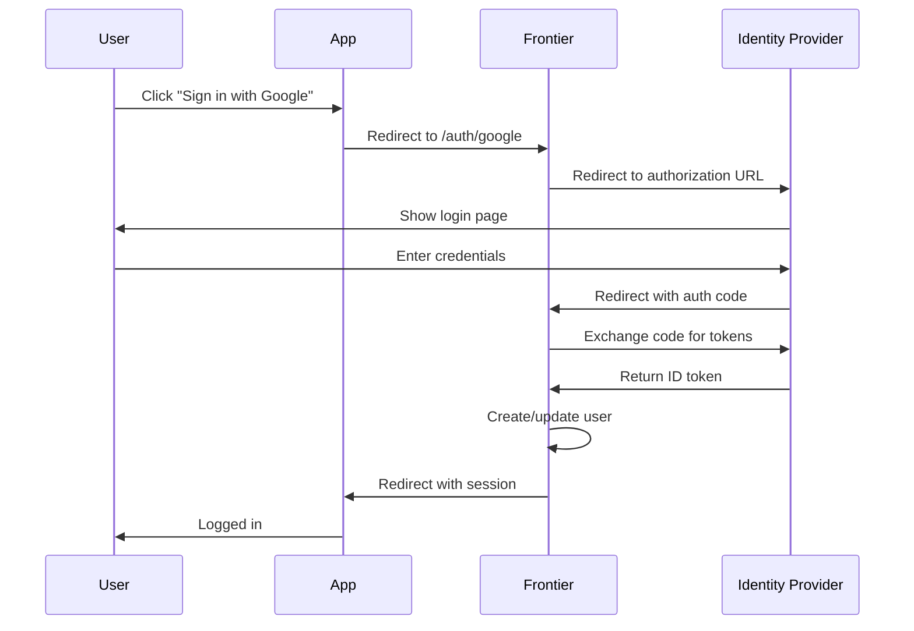

## Overview

Frontier supports OpenID Connect (OIDC) authentication with multiple identity providers. This guide covers configuring the most popular providers:

- Google Workspace and Gmail
- GitHub
- Azure Active Directory / Microsoft Entra ID

<Note>
OIDC provides secure, standards-based authentication and allows users to sign in with their existing accounts from these providers.
</Note>

## Prerequisites

Before configuring OIDC, ensure you have:

- A running Frontier server (see [Getting Started](/guides/getting-started))
- Admin access to your identity provider
- RSA keys generated for JWT signing
- A publicly accessible callback URL (or localhost for development)

## Understanding OIDC Flow

Here's how OIDC authentication works with Frontier:



## Google OIDC Configuration

<Steps>
  <Step title="Create a Google Cloud Project">
    1. Go to [Google Cloud Console](https://console.cloud.google.com)
    2. Create a new project or select an existing one
    3. Note your project ID
  </Step>

  <Step title="Enable Google Identity Platform">
    1. In the Google Cloud Console, go to **APIs & Services** > **Library**
    2. Search for "Google Identity Platform API" or "Google+ API"
    3. Click **Enable**
  </Step>

  <Step title="Create OAuth 2.0 Credentials">
    1. Go to **APIs & Services** > **Credentials**
    2. Click **Create Credentials** > **OAuth client ID**
    3. Choose **Web application** as application type
    4. Configure the OAuth consent screen if prompted:
       - Set app name (e.g., "Acme Corp Portal")
       - Add your domain
       - Add scopes: `email`, `profile`, `openid`
  </Step>

  <Step title="Configure Authorized Redirect URIs">
    Add these redirect URIs:

    **For development:**
    ```
    http://localhost:8000/v1beta1/auth/callback
    ```

    **For production:**
    ```
    https://your-domain.com/v1beta1/auth/callback
    ```

    <Warning>
    The callback URL must exactly match what you configure in Frontier. Including or excluding the trailing slash matters.
    </Warning>
  </Step>

  <Step title="Save your credentials">
    After creating the OAuth client, you'll see:
    - **Client ID**: Looks like `123456789-abc.apps.googleusercontent.com`
    - **Client Secret**: A random string

    Copy both values - you'll need them in your Frontier config.
  </Step>

  <Step title="Update Frontier configuration">
    Add to your `config.yaml`:

    ```yaml
    app:
      authentication:
        callback_urls: 
          - "http://localhost:8000/v1beta1/auth/callback"
        
        oidc_config:
          google:
            client_id: "123456789-abc.apps.googleusercontent.com"
            client_secret: "GOCSPX-your-client-secret"
            issuer_url: "https://accounts.google.com"
            validity: "10m"
    ```
  </Step>

  <Step title="Restart Frontier and test">
    ```bash
    # Restart Frontier
    go run main.go server start
    ```

    Test the authentication flow:
    ```bash
    # This redirects to Google login
    curl -L http://localhost:8000/v1beta1/auth/google
    ```
  </Step>
</Steps>

## GitHub OIDC Configuration

<Steps>
  <Step title="Register a new OAuth App">
    1. Go to [GitHub Developer Settings](https://github.com/settings/developers)
    2. Click **New OAuth App**
    3. Fill in the application details:
       - **Application name**: Your app name
       - **Homepage URL**: `http://localhost:8000` (dev) or your domain
       - **Authorization callback URL**: `http://localhost:8000/v1beta1/auth/callback`
  </Step>

  <Step title="Generate a client secret">
    1. After creating the app, click **Generate a new client secret**
    2. Copy the secret immediately (you won't see it again)
    3. Also copy the **Client ID** shown on the page
  </Step>

  <Step title="Configure Frontier for GitHub">
    Add to your `config.yaml`:

    ```yaml
    app:
      authentication:
        callback_urls:
          - "http://localhost:8000/v1beta1/auth/callback"
        
        oidc_config:
          github:
            client_id: "Iv1.your_client_id"
            client_secret: "your_client_secret_here"
            issuer_url: "https://github.com/login/oauth"
            validity: "10m"
    ```
  </Step>

  <Step title="Test GitHub authentication">
    ```bash
    curl -L http://localhost:8000/v1beta1/auth/github
    ```

    This should redirect you to GitHub's authorization page.
  </Step>
</Steps>

## Azure AD / Microsoft Entra ID Configuration

<Steps>
  <Step title="Register an application in Azure AD">
    1. Go to [Azure Portal](https://portal.azure.com)
    2. Navigate to **Azure Active Directory** (or **Microsoft Entra ID**)
    3. Go to **App registrations** > **New registration**
    4. Fill in:
       - **Name**: Your application name
       - **Supported account types**: Choose based on your needs
         - Single tenant (your org only)
         - Multi-tenant (any Azure AD org)
         - Multi-tenant + personal Microsoft accounts
  </Step>

  <Step title="Configure redirect URI">
    1. In **Authentication**, click **Add a platform**
    2. Choose **Web**
    3. Add redirect URI: `http://localhost:8000/v1beta1/auth/callback`
    4. Under **Implicit grant and hybrid flows**, select:
       - ✓ ID tokens
  </Step>

  <Step title="Create a client secret">
    1. Go to **Certificates & secrets**
    2. Click **New client secret**
    3. Add a description and set expiration (max 24 months)
    4. Copy the secret **Value** immediately
  </Step>

  <Step title="Get your tenant and application IDs">
    From the **Overview** page, copy:
    - **Application (client) ID**: `12345678-1234-1234-1234-123456789abc`
    - **Directory (tenant) ID**: `87654321-4321-4321-4321-987654321abc`
  </Step>

  <Step title="Configure API permissions (optional)">
    1. Go to **API permissions**
    2. Click **Add a permission** > **Microsoft Graph**
    3. Add delegated permissions:
       - `User.Read` (basic profile)
       - `email`
       - `openid`
       - `profile`
    4. Click **Grant admin consent** if required by your organization
  </Step>

  <Step title="Update Frontier configuration">
    Add to your `config.yaml`:

    ```yaml
    app:
      authentication:
        callback_urls:
          - "http://localhost:8000/v1beta1/auth/callback"
        
        oidc_config:
          azure:
            client_id: "12345678-1234-1234-1234-123456789abc"
            client_secret: "your_client_secret_value"
            # For single tenant:
            issuer_url: "https://login.microsoftonline.com/87654321-4321-4321-4321-987654321abc/v2.0"
            # For multi-tenant:
            # issuer_url: "https://login.microsoftonline.com/common/v2.0"
            validity: "10m"
    ```

    <Tip>
    For **multi-tenant** apps, replace the tenant ID in the issuer URL with `common` or `organizations`.
    </Tip>
  </Step>

  <Step title="Test Azure AD authentication">
    ```bash
    curl -L http://localhost:8000/v1beta1/auth/azure
    ```
  </Step>
</Steps>

## Multiple Providers Configuration

You can enable multiple OIDC providers simultaneously:

```yaml config.yaml
app:
  authentication:
    callback_urls:
      - "http://localhost:8000/v1beta1/auth/callback"
    
    oidc_config:
      google:
        client_id: "google-client-id"
        client_secret: "google-secret"
        issuer_url: "https://accounts.google.com"
      
      github:
        client_id: "github-client-id"
        client_secret: "github-secret"
        issuer_url: "https://github.com/login/oauth"
      
      azure:
        client_id: "azure-client-id"
        client_secret: "azure-secret"
        issuer_url: "https://login.microsoftonline.com/{tenant}/v2.0"
```

Each provider will be available at:
- `/v1beta1/auth/google`
- `/v1beta1/auth/github`
- `/v1beta1/auth/azure`

## Custom OIDC Provider

Frontier supports any standard OIDC-compliant provider:

```yaml
app:
  authentication:
    oidc_config:
      custom:
        client_id: "your-client-id"
        client_secret: "your-client-secret"
        issuer_url: "https://your-provider.com"
        validity: "10m"
```

<Accordion title="What is the issuer URL?">
The issuer URL is the base URL of your OIDC provider. Frontier will automatically discover:
- Authorization endpoint
- Token endpoint
- User info endpoint
- JWKS (public keys) endpoint

By appending `/.well-known/openid-configuration` to the issuer URL.
</Accordion>

## Testing Your OIDC Configuration

<CodeGroup>
```bash Test with cURL
# Initiate authentication flow
curl -L http://localhost:8000/v1beta1/auth/google

# This should redirect you to Google's login page
```

```javascript Test with JavaScript
// In your frontend app
window.location.href = 'http://localhost:8000/v1beta1/auth/google?redirect_uri=' + 
  encodeURIComponent('http://localhost:3000/callback');
```

```go Test with Go
package main

import (
    "fmt"
    "net/http"
)

func main() {
    // Redirect user to OIDC provider
    http.HandleFunc("/login", func(w http.ResponseWriter, r *http.Request) {
        http.Redirect(w, r, 
            "http://localhost:8000/v1beta1/auth/google?redirect_uri=http://localhost:3000/callback",
            http.StatusTemporaryRedirect)
    })
    
    // Handle callback
    http.HandleFunc("/callback", func(w http.ResponseWriter, r *http.Request) {
        // Session cookie will be set by Frontier
        fmt.Fprintf(w, "Logged in successfully!")
    })
    
    http.ListenAndServe(":3000", nil)
}
```
</CodeGroup>

## Session Management

After successful OIDC authentication, Frontier:

1. **Creates or updates the user** in the database
2. **Sets a secure session cookie** (if session is configured)
3. **Generates a JWT token** (if token is configured)
4. **Redirects to your application** with the session

Configure session settings:

```yaml
app:
  authentication:
    session:
      hash_secret_key: "hash-secret-should-be-32-chars--"
      block_secret_key: "block-secret-should-be-32-chars-"
      domain: "your-domain.com"
      same_site: "lax"  # lax, strict, or none
      secure: true      # set to true in production (requires HTTPS)
      validity: "720h"   # 30 days
```

## Advanced Configuration

### Custom Claims Mapping

Extract additional claims from the OIDC provider:

```yaml
app:
  authentication:
    token:
      claims:
        add_org_ids: true
        add_user_email: true
```

### Organization Domain Verification

Restrict sign-ups to verified email domains:

```bash
# Add a verified domain to an organization
curl -X POST http://localhost:8000/v1beta1/organizations/{org_id}/domains \
  -H "Content-Type: application/json" \
  -d '{
    "domain": "acme.com",
    "auto_join": true
  }'
```

Now users with `@acme.com` emails automatically join the organization on first login.

### Multiple Callback URLs

Support different environments:

```yaml
app:
  authentication:
    callback_urls:
      - "http://localhost:8000/v1beta1/auth/callback"
      - "https://staging.your-domain.com/v1beta1/auth/callback"
      - "https://your-domain.com/v1beta1/auth/callback"
```

The first URL is used by default. Override with `?callback_url` parameter.

## Troubleshooting

<AccordionGroup>
  <Accordion title="Redirect URI mismatch error">
    **Error**: `redirect_uri_mismatch` from Google/GitHub/Azure

    **Solution**: 
    1. Check that the callback URL in your provider settings **exactly** matches the URL in Frontier config
    2. Don't forget `/v1beta1/auth/callback` path
    3. Ensure `http://` vs `https://` matches
    4. Check for trailing slashes
  </Accordion>

  <Accordion title="Invalid client error">
    **Error**: `invalid_client` or `unauthorized_client`

    **Solution**:
    1. Verify the client ID is correct
    2. Check that the client secret hasn't expired (Azure AD)
    3. Ensure the OAuth app is enabled
    4. For Azure, verify you're using the Application ID, not Object ID
  </Accordion>

  <Accordion title="User created but can't access resources">
    **Issue**: User logs in successfully but has no permissions

    **Solution**:
    Users created via OIDC have no roles by default. You must:
    1. Assign them to organizations
    2. Give them roles in those organizations
    3. Or configure domain auto-join with default roles
  </Accordion>

  <Accordion title="Session cookie not being set">
    **Issue**: Redirected after login but not authenticated

    **Solution**:
    1. Check `session.domain` matches your domain
    2. Set `session.secure: false` for local development
    3. Verify `session.same_site` is compatible with your setup
    4. Check browser console for cookie warnings
  </Accordion>

  <Accordion title="Token expired errors">
    **Issue**: Authentication works but expires immediately

    **Solution**:
    Increase the validity period:
    ```yaml
    oidc_config:
      google:
        validity: "30m"  # Increase from default 10m
    ```
  </Accordion>
</AccordionGroup>

## Security Best Practices

<Warning>
**Production Checklist**:

- ✅ Use HTTPS for all callback URLs
- ✅ Set `session.secure: true` 
- ✅ Use strong, random session secrets (32+ characters)
- ✅ Rotate client secrets regularly
- ✅ Restrict authorized redirect URIs to known domains
- ✅ Enable CORS only for trusted origins
- ✅ Monitor authentication logs for suspicious activity
- ✅ Implement rate limiting on auth endpoints
</Warning>

<Tip>
**Development vs Production**:

For development, you can use `http://localhost` URLs. For production:
1. Always use HTTPS
2. Configure proper CORS settings
3. Use environment-specific callback URLs
4. Store secrets in environment variables or secret managers
</Tip>

## Next Steps

<CardGroup cols={2}>
  <Card title="Organization Domains" icon="globe" href="/authentication/organization-domains">
    Configure domain verification and auto-join
  </Card>
  
  <Card title="Session Management" icon="clock" href="/authentication/sessions">
    Deep dive into session configuration
  </Card>
  
  <Card title="User Management" icon="users" href="/authentication/users">
    Learn about user lifecycle and metadata
  </Card>
  
  <Card title="Admin Portal" icon="desktop" href="/guides/admin-portal">
    Manage authentication settings via UI
  </Card>
</CardGroup>