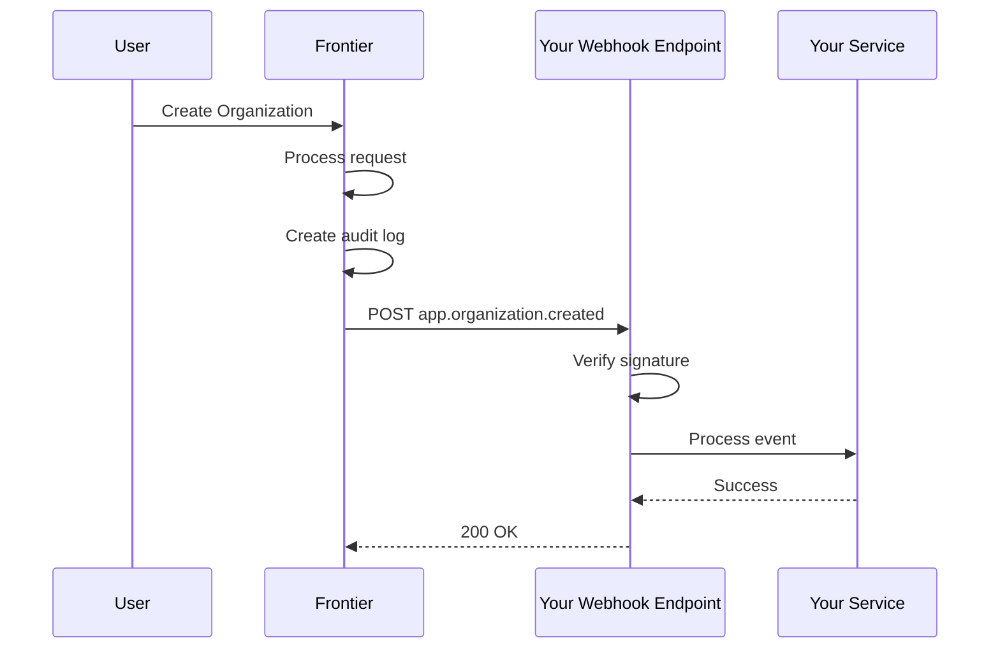

## Overview

Webhooks allow you to receive real-time notifications when events occur in Frontier. When a user performs an action (like creating an organization or updating a resource), Frontier can automatically send a POST request to your specified endpoint.

<Note>
Webhooks are perfect for integrating Frontier with external systems like:
- Analytics platforms
- Customer relationship management (CRM) systems
- Notification services
- Audit and compliance tools
- Custom automation workflows
</Note>

## How Webhooks Work



## Webhook Events

Frontier sends webhooks for these event types:

### User Events
```
app.user.created
app.user.updated
app.user.deleted
app.user.listed
app.serviceuser.created
app.serviceuser.deleted
```

### Organization Events
```
app.organization.created
app.organization.updated
app.organization.deleted
app.organization.member.created
app.organization.member.deleted
```

### Project Events
```
app.project.created
app.project.updated
app.project.deleted
```

### Group Events
```
app.group.created
app.group.updated
app.group.deleted
```

### Permission & Policy Events
```
app.permission.created
app.permission.updated
app.permission.deleted
app.permission.checked
app.policy.created
app.policy.deleted
```

### Resource Events
```
app.resource.created
app.resource.updated
app.resource.deleted
```

### Role Events
```
app.role.created
app.role.updated
app.role.deleted
```

### Billing Events
```
app.billing.entitlement.checked
```

## Creating a Webhook Endpoint

<Steps>
  <Step title="Register webhook via API">
    Send a POST request to create a webhook:

    ```bash
    curl -X POST http://localhost:8000/v1beta1/admin/webhooks \
      -H "Content-Type: application/json" \
      -H "X-Frontier-Email: admin@example.com" \
      -d '{
        "url": "https://your-domain.com/webhooks/frontier",
        "description": "Production webhook for user events",
        "headers": {
          "Authorization": "Bearer your-secret-token",
          "Content-Type": "application/json"
        }
      }'
    ```

    <Note>
    Leave `subscribed_events` empty to receive all events, or specify an array of event types to receive only those.
    </Note>
  </Step>

  <Step title="Save the signing secret">
    The response contains a secret key:

    ```json
    {
      "webhook": {
        "id": "webhook_123abc",
        "url": "https://your-domain.com/webhooks/frontier",
        "secrets": [
          {
            "id": "1",
            "value": "whsec_a1b2c3d4e5f6g7h8i9j0..."
          }
        ]
      }
    }
    ```

    <Warning>
    **Save this secret immediately!** It's only shown once and you'll need it to verify webhook signatures.
    </Warning>
  </Step>
</Steps>

## Subscribing to Specific Events

To receive only certain event types:

```bash
curl -X POST http://localhost:8000/v1beta1/admin/webhooks \
  -H "Content-Type: application/json" \
  -H "X-Frontier-Email: admin@example.com" \
  -d '{
    "url": "https://your-domain.com/webhooks/users",
    "description": "User-related events only",
    "subscribed_events": [
      "app.user.created",
      "app.user.updated",
      "app.user.deleted"
    ],
    "headers": {
      "Authorization": "Bearer secret-token"
    }
  }'
```

<Tip>
**Best Practice**: Create separate webhook endpoints for different event categories (users, organizations, billing) to keep your handlers focused and maintainable.
</Tip>

## Webhook Payload Structure

Every webhook POST request contains:

```json
{
  "id": "evt_1234567890",
  "created_at": "2024-03-03T10:30:00Z",
  "action": "app.user.created",
  "data": {
    "actor": {
      "id": "user_abc123",
      "type": "user",
      "name": "john@example.com"
    },
    "target": {
      "id": "user_xyz789",
      "type": "user",
      "name": "Jane Doe"
    },
    "org_id": "org_123abc",
    "source": "frontier",
    "metadata": {
      "email": "jane@example.com",
      "department": "Engineering"
    }
  }
}
```

### Payload Fields

| Field | Type | Description |
|-------|------|-------------|
| `id` | string | Unique identifier for this webhook event |
| `created_at` | timestamp | When the event occurred (ISO 8601) |
| `action` | string | Event type (e.g., `app.user.created`) |
| `data.actor` | object | Who performed the action |
| `data.target` | object | What was affected by the action |
| `data.org_id` | string | Organization context (if applicable) |
| `data.source` | string | Always "frontier" |
| `data.metadata` | object | Additional event-specific data |

## Implementing a Webhook Receiver

<CodeGroup>
```javascript Node.js / Express
const express = require('express');
const crypto = require('crypto');

const app = express();
app.use(express.json());

const WEBHOOK_SECRET = 'whsec_a1b2c3d4e5f6g7h8i9j0...';

app.post('/webhooks/frontier', (req, res) => {
  // 1. Verify the signature
  const signature = req.headers['x-signature'];
  if (!verifySignature(req.body, signature, WEBHOOK_SECRET)) {
    console.log('Invalid signature');
    return res.status(401).send('Invalid signature');
  }

  // 2. Verify timestamp to prevent replay attacks
  const event = req.body;
  const eventTime = new Date(event.created_at);
  const now = new Date();
  const fiveMinutes = 5 * 60 * 1000;
  
  if (now - eventTime > fiveMinutes) {
    console.log('Event too old');
    return res.status(400).send('Event too old');
  }

  // 3. Process the event
  console.log('Received event:', event.action);
  
  switch (event.action) {
    case 'app.user.created':
      handleUserCreated(event.data);
      break;
    case 'app.organization.created':
      handleOrgCreated(event.data);
      break;
    // ... handle other events
  }

  // 4. Respond quickly
  res.status(200).json({ received: true });
});

function verifySignature(payload, signatureHeader, secret) {
  // Extract secret ID and signature
  const [secretId, signature] = signatureHeader.split('=');
  
  // Compute HMAC
  const payloadString = JSON.stringify(payload);
  const expectedSignature = crypto
    .createHmac('sha256', Buffer.from(secret, 'hex'))
    .update(payloadString)
    .digest('hex');
  
  return crypto.timingSafeEqual(
    Buffer.from(signature),
    Buffer.from(expectedSignature)
  );
}

function handleUserCreated(data) {
  console.log('New user created:', data.target.name);
  // Send welcome email, create CRM record, etc.
}

function handleOrgCreated(data) {
  console.log('New organization:', data.target.name);
  // Initialize org resources, send notifications, etc.
}

app.listen(3000);
```

```go Go
package main

import (
    "crypto/hmac"
    "crypto/sha256"
    "encoding/hex"
    "encoding/json"
    "io"
    "log"
    "net/http"
    "strings"
    "time"
)

const webhookSecret = "whsec_a1b2c3d4e5f6g7h8i9j0..."

type WebhookEvent struct {
    ID        string                 `json:"id"`
    CreatedAt time.Time              `json:"created_at"`
    Action    string                 `json:"action"`
    Data      map[string]interface{} `json:"data"`
}

func webhookHandler(w http.ResponseWriter, r *http.Request) {
    // Read body
    body, err := io.ReadAll(r.Body)
    if err != nil {
        http.Error(w, "Error reading body", http.StatusBadRequest)
        return
    }

    // Verify signature
    signature := r.Header.Get("X-Signature")
    if !verifySignature(body, signature, webhookSecret) {
        http.Error(w, "Invalid signature", http.StatusUnauthorized)
        return
    }

    // Parse event
    var event WebhookEvent
    if err := json.Unmarshal(body, &event); err != nil {
        http.Error(w, "Error parsing JSON", http.StatusBadRequest)
        return
    }

    // Verify timestamp
    if time.Since(event.CreatedAt) > 5*time.Minute {
        http.Error(w, "Event too old", http.StatusBadRequest)
        return
    }

    // Process event
    log.Printf("Received event: %s", event.Action)
    
    switch event.Action {
    case "app.user.created":
        handleUserCreated(event.Data)
    case "app.organization.created":
        handleOrgCreated(event.Data)
    }

    w.WriteHeader(http.StatusOK)
    json.NewEncoder(w).Encode(map[string]bool{"received": true})
}

func verifySignature(payload []byte, signatureHeader, secret string) bool {
    parts := strings.Split(signatureHeader, "=")
    if len(parts) != 2 {
        return false
    }
    
    signature := parts[1]
    
    // Decode secret from hex
    secretBytes, err := hex.DecodeString(secret)
    if err != nil {
        return false
    }
    
    // Compute HMAC
    mac := hmac.New(sha256.New, secretBytes)
    mac.Write(payload)
    expectedSignature := hex.EncodeToString(mac.Sum(nil))
    
    return hmac.Equal([]byte(signature), []byte(expectedSignature))
}

func handleUserCreated(data map[string]interface{}) {
    log.Println("New user created")
    // Your logic here
}

func handleOrgCreated(data map[string]interface{}) {
    log.Println("New organization created")
    // Your logic here
}

func main() {
    http.HandleFunc("/webhooks/frontier", webhookHandler)
    log.Println("Webhook server listening on :3000")
    log.Fatal(http.ListenAndServe(":3000", nil))
}
```

```python Python / Flask
import hmac
import hashlib
import json
from datetime import datetime, timedelta
from flask import Flask, request, jsonify

app = Flask(__name__)

WEBHOOK_SECRET = 'whsec_a1b2c3d4e5f6g7h8i9j0...'

def verify_signature(payload, signature_header, secret):
    """Verify webhook signature using HMAC-SHA256"""
    try:
        secret_id, signature = signature_header.split('=')
        
        # Decode secret from hex
        secret_bytes = bytes.fromhex(secret)
        
        # Compute HMAC
        expected_signature = hmac.new(
            secret_bytes,
            payload.encode('utf-8'),
            hashlib.sha256
        ).hexdigest()
        
        return hmac.compare_digest(signature, expected_signature)
    except Exception as e:
        print(f'Signature verification error: {e}')
        return False

@app.route('/webhooks/frontier', methods=['POST'])
def webhook():
    # Get raw payload
    payload = request.get_data(as_text=True)
    signature = request.headers.get('X-Signature')
    
    # Verify signature
    if not verify_signature(payload, signature, WEBHOOK_SECRET):
        return jsonify({'error': 'Invalid signature'}), 401
    
    # Parse event
    event = json.loads(payload)
    
    # Verify timestamp
    created_at = datetime.fromisoformat(event['created_at'].replace('Z', '+00:00'))
    if datetime.now(created_at.tzinfo) - created_at > timedelta(minutes=5):
        return jsonify({'error': 'Event too old'}), 400
    
    # Process event
    print(f"Received event: {event['action']}")
    
    if event['action'] == 'app.user.created':
        handle_user_created(event['data'])
    elif event['action'] == 'app.organization.created':
        handle_org_created(event['data'])
    
    return jsonify({'received': True}), 200

def handle_user_created(data):
    print(f"New user created: {data['target']['name']}")
    # Your logic here

def handle_org_created(data):
    print(f"New organization: {data['target']['name']}")
    # Your logic here

if __name__ == '__main__':
    app.run(port=3000)
```
</CodeGroup>

## Security Best Practices

### 1. Always Verify Signatures

The `X-Signature` header contains an HMAC-SHA256 signature:

```
X-Signature: 1=abc123def456...
```

Format: `{secret_id}={signature}`

<Steps>
  <Step title="Extract signature from header">
    ```javascript
    const signatureHeader = req.headers['x-signature'];
    const [secretId, signature] = signatureHeader.split('=');
    ```
  </Step>

  <Step title="Compute expected signature">
    ```javascript
    const crypto = require('crypto');
    
    const payload = JSON.stringify(req.body);
    const expectedSignature = crypto
      .createHmac('sha256', Buffer.from(webhookSecret, 'hex'))
      .update(payload)
      .digest('hex');
    ```
  </Step>

  <Step title="Compare using timing-safe function">
    ```javascript
    const isValid = crypto.timingSafeEqual(
      Buffer.from(signature),
      Buffer.from(expectedSignature)
    );
    ```

    <Warning>
    Never use `===` for signature comparison! Use `crypto.timingSafeEqual()` or equivalent to prevent timing attacks.
    </Warning>
  </Step>
</Steps>

### 2. Verify Timestamp

Reject events older than 5 minutes:

```javascript
const eventTime = new Date(event.created_at);
const now = new Date();
const fiveMinutes = 5 * 60 * 1000;

if (now - eventTime > fiveMinutes) {
  return res.status(400).send('Event too old');
}
```

This prevents replay attacks.

### 3. Use HTTPS

<Warning>
**Production webhooks must use HTTPS**. Frontier will not send webhooks to HTTP endpoints in production.
</Warning>

### 4. Authenticate Requests (Optional)

Add a custom header for additional security:

```bash
curl -X POST http://localhost:8000/v1beta1/admin/webhooks \
  -d '{
    "url": "https://your-domain.com/webhooks/frontier",
    "headers": {
      "Authorization": "Bearer your-static-token",
      "X-Webhook-Secret": "additional-secret"
    }
  }'
```

Verify this header in your webhook handler:

```javascript
if (req.headers['x-webhook-secret'] !== process.env.WEBHOOK_SECRET) {
  return res.status(401).send('Unauthorized');
}
```

## Retry Policy

Frontier automatically retries failed webhook deliveries:

- **Retry count**: Up to 3 attempts
- **Retry timing**: Exponential backoff (3s, 6s, 12s)
- **Success criteria**: HTTP 2xx response
- **Timeout**: 3 seconds per attempt

<Note>
If all retries fail, the webhook delivery is marked as failed. You can view failed deliveries in audit logs.
</Note>

## Managing Webhooks

### List All Webhooks

```bash
curl http://localhost:8000/v1beta1/admin/webhooks \
  -H "X-Frontier-Email: admin@example.com"
```

Response:
```json
{
  "webhooks": [
    {
      "id": "webhook_123abc",
      "url": "https://your-domain.com/webhooks/frontier",
      "description": "Production webhook",
      "state": "enabled",
      "subscribed_events": [],
      "created_at": "2024-03-01T10:00:00Z"
    }
  ]
}
```

### Update a Webhook

```bash
curl -X PUT http://localhost:8000/v1beta1/admin/webhooks/{webhook_id} \
  -H "Content-Type: application/json" \
  -H "X-Frontier-Email: admin@example.com" \
  -d '{
    "url": "https://new-domain.com/webhooks/frontier",
    "subscribed_events": ["app.user.created", "app.user.updated"]
  }'
```

### Disable a Webhook

```bash
curl -X PUT http://localhost:8000/v1beta1/admin/webhooks/{webhook_id} \
  -H "Content-Type: application/json" \
  -H "X-Frontier-Email: admin@example.com" \
  -d '{
    "state": "disabled"
  }'
```

### Delete a Webhook

```bash
curl -X DELETE http://localhost:8000/v1beta1/admin/webhooks/{webhook_id} \
  -H "X-Frontier-Email: admin@example.com"
```

## Testing Webhooks

### Local Development with ngrok

<Steps>
  <Step title="Start your webhook receiver locally">
    ```bash
    node webhook-server.js
    # Listening on http://localhost:3000
    ```
  </Step>

  <Step title="Expose local server with ngrok">
    ```bash
    ngrok http 3000
    ```

    You'll get a public URL like:
    ```
    https://abc123.ngrok.io
    ```
  </Step>

  <Step title="Register webhook with ngrok URL">
    ```bash
    curl -X POST http://localhost:8000/v1beta1/admin/webhooks \
      -d '{
        "url": "https://abc123.ngrok.io/webhooks/frontier"
      }'
    ```
  </Step>

  <Step title="Trigger events and watch logs">
    Create a user or organization and watch your webhook receiver logs.
  </Step>
</Steps>

### Testing with webhook.site

For quick testing without code:

1. Go to [webhook.site](https://webhook.site)
2. Copy your unique URL
3. Register it as a webhook in Frontier
4. Trigger events and watch them appear on webhook.site

## Common Use Cases

<AccordionGroup>
  <Accordion title="Send Slack notifications on new users">
    ```javascript
    async function handleUserCreated(data) {
      await fetch(process.env.SLACK_WEBHOOK_URL, {
        method: 'POST',
        headers: { 'Content-Type': 'application/json' },
        body: JSON.stringify({
          text: `New user registered: ${data.target.name}`,
          blocks: [
            {
              type: 'section',
              text: {
                type: 'mrkdwn',
                text: `*New User*\nEmail: ${data.metadata.email}`
              }
            }
          ]
        })
      });
    }
    ```
  </Accordion>

  <Accordion title="Sync users to external CRM">
    ```javascript
    async function handleUserCreated(data) {
      // Create contact in your CRM
      await crmClient.contacts.create({
        email: data.metadata.email,
        name: data.target.name,
        source: 'frontier',
        frontier_user_id: data.target.id
      });
    }

    async function handleUserUpdated(data) {
      // Update CRM contact
      await crmClient.contacts.update(
        data.target.id,
        data.metadata
      );
    }
    ```
  </Accordion>

  <Accordion title="Track analytics events">
    ```javascript
    async function handleEvent(event) {
      // Send to analytics platform
      await analytics.track({
        userId: event.data.actor.id,
        event: event.action,
        properties: {
          targetId: event.data.target.id,
          targetType: event.data.target.type,
          orgId: event.data.org_id,
          ...event.data.metadata
        },
        timestamp: event.created_at
      });
    }
    ```
  </Accordion>

  <Accordion title="Trigger automation workflows">
    ```javascript
    async function handleOrgCreated(data) {
      // Create default resources
      await createDefaultProjects(data.target.id);
      
      // Set up billing account
      await billingService.createAccount(data.target.id);
      
      // Send welcome email to org owner
      await sendWelcomeEmail(data.actor.id);
    }
    ```
  </Accordion>
</AccordionGroup>

## Troubleshooting

<AccordionGroup>
  <Accordion title="Webhooks not being received">
    **Checklist**:
    1. Verify webhook is enabled: Check `state` in webhook list
    2. Check webhook URL is accessible: Test with curl
    3. Ensure firewall allows incoming requests
    4. Verify your endpoint returns 2xx status
    5. Check Frontier logs for delivery errors
  </Accordion>

  <Accordion title="Signature verification fails">
    **Common issues**:
    1. Using wrong secret (copy the hex value exactly)
    2. Modifying request body before verification
    3. Not decoding secret from hex to bytes
    4. Using wrong hash algorithm (must be SHA-256)
    5. String encoding issues (use UTF-8)
  </Accordion>

  <Accordion title="Receiving duplicate events">
    **Causes**:
    1. Not responding with 2xx status (triggers retries)
    2. Slow processing causing timeouts
    3. Multiple webhooks registered with same URL
    
    **Solution**: Use event `id` to deduplicate:
    ```javascript
    const processedEvents = new Set();
    
    if (processedEvents.has(event.id)) {
      return res.status(200).send('Already processed');
    }
    processedEvents.add(event.id);
    ```
  </Accordion>

  <Accordion title="Webhook endpoint timing out">
    **Solution**: Process events asynchronously
    
    ```javascript
    app.post('/webhooks/frontier', async (req, res) => {
      // Verify signature
      if (!verifySignature(req.body, req.headers['x-signature'])) {
        return res.status(401).send('Invalid signature');
      }
      
      // Respond immediately
      res.status(200).json({ received: true });
      
      // Process asynchronously
      processEventAsync(req.body).catch(console.error);
    });
    
    async function processEventAsync(event) {
      // Long-running processing here
      await heavyOperation(event);
    }
    ```
  </Accordion>
</AccordionGroup>

## Webhook Configuration

Configure webhook encryption in Frontier:

```yaml config.yaml
app:
  webhook:
    # Encryption key for secrets stored in database
    # Must be 32 characters
    encryption_key: "encryption-key-should-be-32-chars--"
```

<Warning>
**Important**: This encrypts webhook secrets in the database. Change this key requires re-registering all webhooks.
</Warning>

## Next Steps

<CardGroup cols={2}>
  <Card title="Audit Logs" icon="list-check" href="/guides/audit-logs">
    Learn about audit logging and compliance
  </Card>
  
  <Card title="Admin Portal" icon="desktop" href="/guides/admin-portal">
    Manage webhooks through the UI
  </Card>
  
  <Card title="API Reference" icon="code" href="/api-reference/overview">
    Explore the full webhook API
  </Card>
  
  <Card title="Authorization" icon="shield" href="/authorization/overview">
    Learn about permission checks
  </Card>
</CardGroup>